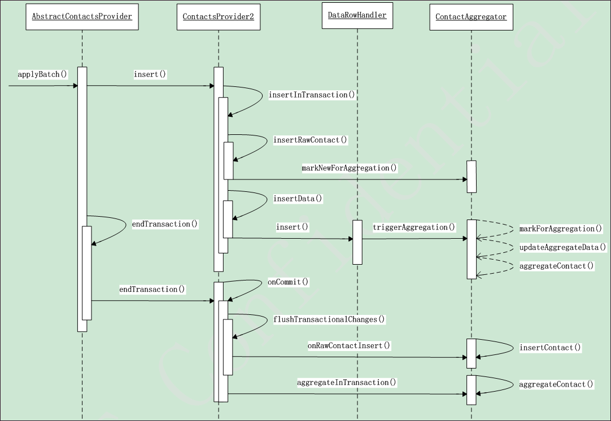

- *AP*->AbstractContactsProvider
- *P*->ContactsProvider2
- *A*->ContactAggregator
- *T*->TransactionContext

#### 插入联系人涉及合并的流程

- AP.applyBatch()：
>调用AP.insert ()插入数据，AP.insert ()中根据Uri插入数据到不同的表。

- P.insertRawContact():
>- SQLiteDatabase.insert()执行实际的数据插入操作，返回raw_contact_id；
>- A.markNewForAggregation()中用A.mRawContactsMarkedForAggregation记录对应raw_contact_id及agg_mode；
>- T.rawContactInserted()中用T.mInsertedRawContacts记录插入数据的raw_contact_id。

- P.insertData()：
>- 调用不同数据类型的DataRowHandler更新数据，name、nickname、number和email的insert/updata/delete操作会调用A.triggerAggregation()，其中根据raw_contacts表中的agg_mode调用不同的流程；
>- default：A.markForAggregation()在A.mRawContactsMarkedForAggregation中记录；
>- suspended：根据rawContactId查询contactId，传入A.updateAggregateData()-> A.computeAggregateData()更新contacts表中对应记录；
>- immediate：A.aggregateContact()合并联系人。

- P.onCommit()：
>- AP.applyBatch()->AP.endTransaction()->T.finish()->P.onCommit()；
>- P.flushTransactionalChanges()：遍历已插入联系人T.mInsertedRawContacts，调用A.onRawContactInsert()->A.insertContact()->A.computeAggregateData()执行contacts表的插入操作；
>- A.aggregateInTransaction()：遍历A.mRawContactsMarkedForAggregation中所有raw_contacts各自执行A.aggregateContact()/synchronized进行合并。

- A.aggregateContact()/synchronized：
>- A.pickBestMatchBasedOnExceptions()基于agg_exceptions表挑选最佳匹配contact_id；
>- 找到有效contact_id，进行合并；
>- 未找到有效contact_id，而且当前联系人是新建的或可见的，调用A.pickBestMatchBasedOnData()基于data表挑选最佳匹配，进行合并。

#### 更新/删除涉及合并的操作

更新/删除对应的data数据后， DataRowHandler调用A.triggerAggregation()，以及后续触发P.onCommit()，后续流程与插入类似。

#### 手动合并/拆分联系人流程

- AP.applyBatch()中，调用数据库的update接口，更新agg_exceptions的记录，AP.update()->P.updateInTransaction()->P.updateAggregationException()，然后针对两个raw_contacts_id分别执行A.markForAggregation()->A.aggregateContact()进行实际操作。
- 合并和拆分通过agg_exceptions中type值区分，拆分类型为AggregationExceptions.TYPE_KEEP_SEPARATE，还有TYPE_AUTOMATIC和TYPE_KEEP_TOGETHER，合并默认为TYPE_AUTOMATIC。
- 多个联系人拆分会产生数对两两拆分的数据库操作，通过applyBatch()执行。

#### ContactMatcher

- 该类为合并提供候选contacts，每个候选contact会与主联系人数据进行对比，得到一个匹配分数，最佳匹配根据分数选择。
- 用于匹配的数据：Identity/name_lookup(primary)，email/phone(secondary)。

- 手动合并建议查询A.queryAggregationSuggestions()
>- a.    调用A.findMatchingContacts()获取所有匹配分数大于阈值(50/100)的contacts的MatchScore；其中调用updateMatchScoresForSuggestionsBasedOnDataMatches()更新contacts的MatchScore；
>- b.    调用A.queryMatchingContacts()按查询参数返回符合要求的Cursor。

- 自动合并最佳匹配查询A.aggregateContact()/synchronized
>- a. pickBestMatchBasedOnExceptions()先基于agg_exceptions表获取最佳匹配contact_id；
>- b. 未找到的话调用pickBestMatchBasedOnData()基于联系人详细数据选择；
>>- updateMatchScoresBasedOnDataMatches()：其中依次更新       Identity/Name数据的MatchScore，然后调用pickBestMatch()/ContactMatcher取大于阈值(70/100)的最佳匹配；未找到大于阈值的contact_id，则更新  Email/Phone数据的 MatchScore；找到则直接返回；
>>- pickBestMatchBasedOnSecondaryData()：再根据Email/Phone的    MatchScore查找，prepareSecondaryMatchCandidates()/ContactMatcher根据 Email/phone/nickname获取候选contacts；再与当前联系人的raw_contacts的name_lookup进行匹配，更新MatchScore；调用 pickBestMatch()/ContactMatcher取大于阈值(50/100)的最佳匹配。

- 更新contacts的MatchScore
>- updateMatchScoresBasedOnIdentityMatch：如果两个对比的raw_contacts的Identity字段namespace和Identity值相等，matchIdentity()/ContactMatcher，更新分值为100；
>- updateMatchScoresBasedOnNameMatches：matchName()/ContactMatcher，对比name_lookup数据查询normolized_name相同的匹配，根据name_lookup中name_type类型不同，分值50-99不等，如果是两个contacts的Nickname相同，分值71；matchName()/ContactMatcher依据严格程度不同的算法参数，可能返回0分；
>- updateMatchScoresBasedOnEmailMatches：email字段数据相同的得分71；
>- updateMatchScoresBasedOnPhoneMatches：使用PHONE_NUMBERS_EQUAL判断phone数据相同的得分71。
