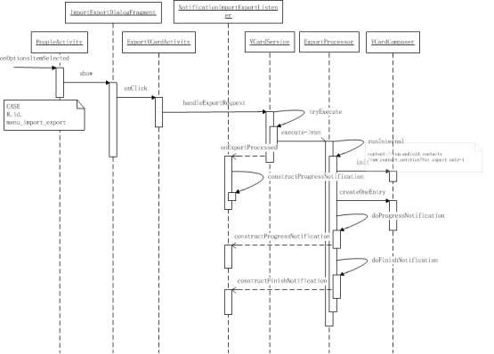
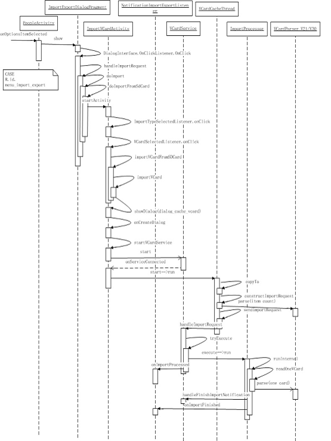

#### vCard介绍(以下内容主要来自wikipedia)

vCard或称做Versitcard，是电子名片的文件格式标准。它一般附加在电子邮件之后，但也可以用于其它场合（如在因特网上相互交换）。vCard可包含的信息有：姓名、地址信息、电话号码、URL，logo，相片等。

最早是由Versit联盟于1995年提出的，当时联盟成员包括苹果公司，AT&T科技（后来的朗讯），IBM及西门子。在1996年十二月，格式的拥有权移至因特网邮件联盟（IMC），此联盟是由一些关注因特网电子邮件的公司所组成。

vCard标准的2.1版被电子邮件客户端广泛支持。3.0版是一个包含在RFC 2425和RFC 2426中的IETF标准跟踪提案。4.0 版定义在RFC 6350中，而且支持RFC 6351定义的新XML句法xCard。

标准互联网媒体类型(IMT)，也叫做mimetype是text/vcard。vCard的常用文件扩展名是.vcf，也有用.vcard的。不同的程序对vCard标准实现亦不同。

参考资料：http://en.wikipedia.org/wiki/Vcard

下面是一个包含个人信息的vCard 2.1文件样例。
```
BEGIN:VCARD
VERSION:2.1
N:Gump;Forrest
FN:Forrest Gump
ORG:Gump Shrimp Co.
TITLE:Shrimp Man
TEL;WORK;VOICE:(111) 555-1212
TEL;HOME;VOICE:(404) 555-1212
ADR;WORK:;;100 Waters Edge;Baytown;LA;30314;United States of America
LABEL;WORK;ENCODING=QUOTED-PRINTABLE:100 Waters Edge=0D=0ABaytown, LA 30314=0D=0AUnited States of America
ADR;HOME:;;42 Plantation St.;Baytown;LA;30314;United States of America
LABEL;HOME;ENCODING=QUOTED-PRINTABLE:42 Plantation St.=0D=0ABaytown, LA 30314=0D=0AUnited States of America
EMAIL;PREF;INTERNET:forrestgump@walladalla.com
REV:20080424T195243Z
END:VCARD
```
vCard数据格式行是： `type [;para]:value`

vCard内容必须以BEGIN:VCARD开头，以END:VCARD结尾。之间必须包含VERSION和FN属性。不同的版本支持的类型有所变化，可以定义自己的类型，自己定义的类型需要以“x-”开头。

#### 应用流程

Android联系人应用提供对vCard文件的部分支持。包括对不同版本的vCard文件进行解析，恢复到联系人数据库；以及对联系人进行备份。
ICS支持2.1/3.0版本的导入，相关代码在src\com\android\contacts\vcard目录下。
PeopleActivity菜单中Import/Export，启动ImportExportDialogFragment，提供导入导出选项，包含SIM/SD Card导入导出、分享可见联系人。
a. 导出流程
1. 导出直接启动ExportVCardActivity；
2. onCreate()中先查找”外部存储设备”，未找到则提示失败并退出；否则启动mService/VCardService；
3. 服务启动后，弹出确认对话框，确认后创建request/ExportRequest，mService.handleExportRequest(request, new NotificationImportExportListener())；
4. ExportProcessor中做实际的处理。



b. 导入流程
1. 导入根据情况显示账号选择对话框，选中的账号通过Intent的Extra传给ImportVCardActivity；
2. ImportVCardActivity：onCreate()取出账号信息，调用startImport()开始导入流程；如果Intent中包含Uri，表示用户使用打开方式(比如从Filer点击打开)，直接importVCard()；否则表示用户用导入菜单启动功能，查找”外部存储” 中的vCard文件doScanExternalStorageAndImportVCard()，没有”外部存储设备”则失败；
3. 找到存储介质后启动VCardScanThread线程，对相应目录进行递归扫描，记录所有找到的可读vCard文件的文件名、路径及其他属性信息；然后启动文件选择流程，只找到一个vCard文件时自动开始导入，多个时可选一个/多个/所有；各种不同的选择方式经过处理，都会将选中的文件Uri存入一个Uri数组，最后调用importVCard(Uri[])开始导入；
4. importVCard()创建mConnection/ImportRequestConnection，启动并绑定VCardService；服务连接成功后，启动线程VCardCacheThread进行缓存，该线程是将数据库类Uri(如content://…)指向的实际文件复制到本地；针对每一个vCard文件调用constructImportRequest()创建一个ImportRequest，存到一个数组requests中；mConnection.sendImportRequest(requests)-> VCardService. handleImportRequest(requests, mListener)，监听器mListener/NotificationImportExportListener用于监听导入进程；
5. VCardService. handleImportRequest() 中依次为每个vCard文件启动ImportProcessor进行导入readOneVCard()。



#### 框架支持

相关代码目录`frameworks\opt\vcard\java\com\android\vcard`，用于vCard的解析、构建等基本支持。
- VCardParser*：对不同版本的vCard文件进行解析；
- VCardProperty：表示vCard记录的一行/一个属性，对应联系人的一种信息；
- VCardEntry：表示一个vCard记录，对应一条联系人；
- VCardEntryCommitter：导入联系人想数据库提交联系人信息；VCardEntryConstructor/VcardEntryCounter(extends VCardInterpreter)：解析VCardEntry内部各项信息；对VCardEntry进行计数；
- VcardEntryHandler：辅助VCardEntryConstructor；
- VCardComposer：整理联系人信息，调用VCardBuilder创建vCard记录；
- VCardBuilder：用来把单个联系人的各中信息组合为一个vCard记录；
- VCardSourceDetector：解析vCard文件，预计文件的格式等信息。

#### 其他

本文档只是简单介绍联系人中vCard相关流程，没有框架中vCard相关类的使用方法，希望有后来者补充。
