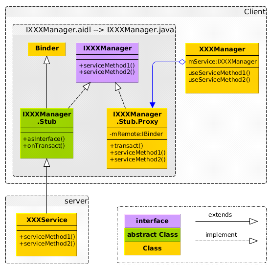

#### 一、AIDL工作原理

##### AIDL定义

Android平台，每个应用程序都拥有自己的进程空间，通常一个进程空间不能访问另一个进程空间，即一个应用不能访问另一个应用。为了解决这个问题，Android提供了AIDL，采用AIDL方式来实现。

AIDL是 Android Interface definition language的缩写，是android内部进程通信接口的描述语言。它是一种后缀为.aidl的文件，在编译时由AIDL编译器自动生成.java文件。。。AIDL是一种接口定义语言（IDL），用于约束两个进程间的通讯规则，供编译器生成代码，实现Android设备上的两个进程间通信(IPC)。

**IPC**：interprocess communication 内部进程通信。

##### AIDL工作原理

要知道AIDL的工作原理就需要分析AIDL语言生成的接口文件。

**1. AIDL语言怎样生成接口文件**

在Eclipse Android工程的Java包目录中建立一个扩展名为aidl的文件。如果aidl文件的内容是正确的，ADT会自动生成一个Java接口文件（`*.java`）

**2. 接口文件分析**

这个java接口文件中主要有3个类：
- IXXManager-------是总的接口类，一般在Client中使用，用来指向Proxy对象。
- IXXManager.stub.Proxy-------是Service的Proxy类，负责数据的打包工作。
- IXXManager.Stub------是Service的工具类，负责数据的解析工作。Service需要继承此类。

具体关系图如下：



- IXXManager-------是一个接口类，提供了Service的接口方法，这些方法在Service和Proxy中实现。
- IXXManager.Stub------被XXXService继承。实现了OnTransact()方法，里面按照规范实现了解析数据包的功能。
>另外还有一个方法asInterface，负责创建一个Proxy对象，参数是IBinder类型，实质是BinderProxy类型。

- IXXManager.stub.Proxy----是Proxy组件，使用transact方法发送数据。
>需要实现自定义函数serviceMethod1和serviceMethod2。

- XXXService------需要实现自定义函数serviceMethod1和serviceMethod2。

**3. Proxy和Service的通信模型**

Proxy和Service的通信模型如下：


注意：
>对于Service使用者（Activity）来说，需要按照以下方法使用Service：
```Java
XXXManager mXXXManager = (XXXManager) getSystemService(Context.SENSOR_SERVICE);
mXXXManager.XXX();
```
通过getSystemService获取XXXService的Manager对象，并调用相关服务方法。

小结：AIDL的作用就是自动生成一个Service的Stub类和Proxy类，为Service开发者和使用者完成数据解析和打包工作。

#### 二、AIDL如何使用，即如何建立AIDL服务

上面分析了AIDL工作原理，下面将分析具体的实例以加深对AIDL的理解。

建立AIDL服务需要分两个部分：一个是服务端，一个是客户端

##### 服务端

服务端步骤

- 建立一个扩展名为aidl的文件。
- 建立一个服务类（Service的子类），实现由aidl文件生成的Java接口。
- 在AndroidManifest.xml文件中配置AIDL服务，尤其要注意的是，<action>标签中android:name的属性值就是客户端要引用该服务的ID，也就是Intent类的参数值。

1.建立一个aidl文件。在Java包src目录中建立一个IMyService.aidl文件。
```Java
package com.example.ssss;
interface IMyService {
String getValue();
}
```
IMyService.aidl文件的内容与Java代码非常相似，但要注意：
- 不能加修饰符（例如，public、private）、AIDL服务不支持的数据类型（例如，InputStream、OutputStream）等内容。
- Aidl默认支持的类型包话java基本类型（int、long、boolean等）和（String、List、Map、CharSequence），使用这些类型时不需要import声明。
- 在aidl文件中所有非Java基本类型参数必须加上in、out、inout标记，以指明参数是输入参数、输出参数还是输入输出参数。

如果IMyService.aidl文件中的内容输入正确，ADT会自动生成一个IMyService.java文件。用户一般并不需要关心这个文件的具体内容，也不需要维护这个文件。而这个文件的具体内容在上节讲原理的时候已经讲过了，可以由他知道AIDL工作原理。。。

2.编写一个MyService类，继承Service。在MyService类中定义了一个内嵌类（MyServiceImpl），该类是IMyService.Stub的子类。MyService类的代码如下：
```Java
package com.example.ssss;

import android.app.Service;
import android.content.Intent;
import android.os.IBinder;
import android.os.RemoteException;

public class MyService extends Service {
public class MyServiceImpl extends IMyService.Stub {
@Override
public String getValue() throws RemoteException {
return "Android/OPhone开发讲义";
}
}
@Override
public IBinder onBind(Intent intent) {
return new MyServiceImpl();
}

}
```

需要注意：
>- onBind方法必须返回MyServiceImpl类的对象实例，否则客户端无法获得服务对象。
>- IMyService.Stub是根据IMyService.aidl文件自动生成的，用户可以不关心这个类内容。

3.在AndroidManifest.xml文件中配置MyService类，代码如下：
```xml
<service android:name=".MyService" >
    <intent-filter>
        <action android:name="net.blogjava.mobile.aidl.IMyService" />
    </intent-filter>
</service>
```

##### 客户端

- 首先新建一个Android工程，并将自动生成的IMyService.java文件连同包目录一起复制到工程的src目录中。
- 调用AIDL服务。调用AIDL服务首先要绑定服务，然后才能获得服务对象

具体代码如下：
```Java
private IMyService myService = null;

private TextView textView;
private ServiceConnectionserviceConnection = new ServiceConnection() {
    @Override
    public void onServiceConnected(ComponentName name, IBinder service) {
        // 获得服务对象
        myService = IMyService.Stub.asInterface(service);
    }
    @Override
        public void onServiceDisconnected(ComponentName name) {
    }
};
@Override
public void onClick(View view) {
    switch (view.getId()) {
    case R.id.btnBindAIDLService:
        // 绑定AIDL服务
        bindService(new Intent("net.blogjava.mobile.aidl.IMyService"), serviceConnection, Context.BIND_AUTO_CREATE);
        break;
    case R.id.btnInvokeAIDLService:
        try {
            textView.setText(myService.getValue());
            // 调用服务端的getValue方法
        } catch (Exception e) {
        }
        break;
    }
}
```
功能实现：在点击绑定服务按钮的时候去绑定服务并获取服务对象，在点击显示按钮的时候，获取服务端信息，并显示在TextView中。

#### android中 本地服务和 AIDL服务的区别

- 本地服务不支持onBind(),它从onBind()返回null，这种类型的服务只能由承载服务的应用程序组件访问。可以调用 startService来调用本地服务。
- AIDL服务可以同时供同一进程内的组件和其他应用程序的组件使用。这种类型的服务在AIDL文件中为自身与其客户端定义一个契约。服务实现 AIDL契约，而客户端绑定到 AIDL定义。服务通过从 onBind()方法 返回AIDL接口的实现，来实现契约。客户端通过调用 bindService()来绑定到AIDL服务，并调用 unBindService()来从服务断开。
