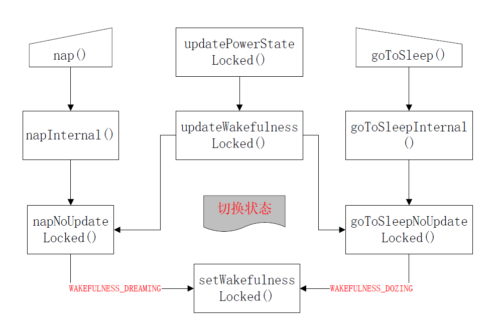
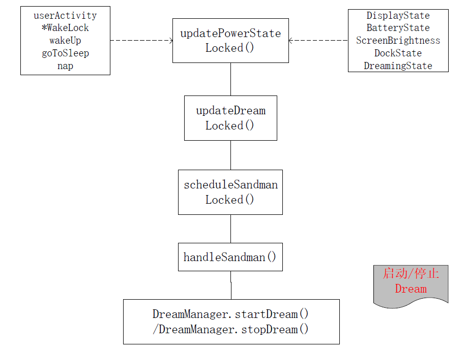

# Android Doze Dream & DeviceIdle

本文主要介绍Android M开始新加入的灭屏省电模式，大家一般称作Doze模式(这种叫法容易发生混淆)。由于Doze和Dream实际是同一类东西（Display state），所以放在一块讨论一下。

# 0. 概念说明

1. **Doze**：“主动显示”状态，主要功能是当灭屏状态下接收到短信、蓝牙等通知后自动点亮屏幕。“设置-显示”中有对应的开关，设置数据库对应的键为`Settings.Secure.DOZE_ENABLED`。
2. **Dream**：就是Daydream屏保模式，是一种显示状态。
3. **DeviceIdle**：这个才是真正的灭屏省电功能，灭屏超过一定时间后，手机会进入该模式，限制网络连接，后台运行，CPU Wakelock，闹钟等，对耗电进行优化。设置中“电池-电池优化”中设置。

# 1. Doze vs Dream

Doze和Daydream功能由`DreamManagerService`和`PowerManagerService`共同控制。第三方应用可以实现Daydream，添加到“设置-显示-屏保”中供用户选择，Doze服务是由系统实现的。

## 1.1 Daydream

第三方应用如果要提供Daydream功能，需要扩展`android.service.dreams.DreamService`，提供相应的功能。如果targetApi大于21，需要声明权限。还可以通过`meta-data`声明附加信息，比如设置界面。整个功能的设计类似于动态壁纸(WallpaperService)。

典型声明如下：
```xml
<!-- AndroidManifest.xml -->
...
<service
    android:name=".MyDream"
    android:exported="true"
    android:icon="@drawable/my_icon"
    android:label="@string/my_dream_label"
    android:permission="android.permission.BIND_DREAM_SERVICE">
    <intent-filter>
        <action android:name=”android.service.dreams.DreamService” />
        <category android:name=”android.intent.category.DEFAULT” />
    </intent-filter>

    <!-- Point to additional information for this dream (optional) -->
    <meta-data
        android:name="android.service.dream"
        android:resource="@xml/my_dream" />
</service>
...

<!-- res/xml/my_dream.xml -->
<dream xmlns:android="http://schemas.android.com/apk/res/android"
    android:settingsActivity="com.example.app/.MyDreamSettingsActivity" />
```

> 需要的话可以查看`packages/screensavers`目录下原生Daydream的代码。

## 1.2 DozeService

系统通过`framework-res`中的配置项`config_dozeComponent`配置默认的Doze服务。目前Android默认的配置是`com.android.systemui/.doze.DozeService`，设置中主动显示描述的功能“收到通知自动亮屏”就是在这个服务中实现的。通过这个配置项的设计可以看出只有ROM厂商可以修改。

## 1.3 DreamManagerService

DozeService也是继承自`DreamService`，所以逻辑上只是区分于其他Dreams的特殊Daydream，只是不同的前提条件下启动不同的Dream。

### DozeService/Daydreams的启动

1. PowerManager切换状态
   
2. PowerManager启动Dreams逻辑
   
3. DreamManager逻辑
   

### DreamService实现

DreamService的生命周期如下，可以对应到上一节DreamManager的逻辑流程图。一般第三方实现需要实现的方法也是这几个：
```Java
// Use this for initial setup, such as calling setContentView()
public void onAttachedToWindow()

//Your dream has started, so you should begin animations or other behaviors here.
public void onDreamingStarted()

//Use this to stop the things you started in onDreamingStarted()
public void onDreamingStopped()

//Use this to dismantle resources (for example, detach from handlers and listeners.
public void onDetachedFromWindow()
```

# 2. DeviceIdle

灭屏省电功能，与前面讨论的Doze/Dream没有关系，Doze/Dream是一种耗电的功能，而这个功能是用来省电的，为区分叫做“Device Idle模式”。

系统通过`framework-res`中的配置项`config_enableAutoPowerModes`进行开关设置。`DeviceIdleController`是Device Idle模式的关键服务，属于SystemService，从SystemServer中启动，也就是开机运行。

## 2.1 Deep Doze Mode

API 23中直接称其为Doze Mode。无论Target SDK是多少，设备是Android API 23或以上会启用该模式。在用户离开设备以后，尽可能的减少手机电量的消耗。模式期间，通过移动窗口打包任务请求，并且间隔时间会越来越久。

开发人员并不需要做特殊的适配，但是会对所有Schedule的方式(Job Scheduler、AlarmManager)进行影响。

进入条件，会同时满足以下情况过后一段时间(大约30分钟)以后生效:
- 手机没有在充电
- 屏幕被关闭
- 手机各方状态保持稳定

退出条件是，进入条件中任意条件状态发生变化。

在两个处理窗口之间的手机状态：
- 对所有应用拒绝网络访问。
- 所有JobScheduler、AlarmManager的任务都会被延后到窗口中执行。
- 系统会拒绝所有来自应用的WakeLock。
- 停止所有WiFi以及GPS扫描。
- 减少位置事件从设备检测WiFi热点。

## 2.2 Light Doze Mode

API 24 或以上会启用该模式，相比Deep Doze Mode，打包任务的频率会更高些。

进入条件，会同时满足以下情况后一段时间(大约几分钟)以后生效：
- 手机没有在充电
- 屏幕被关闭
- 处于稳定状态/不稳定状态

或者在以下的条件:
- 处于Deep Doze Mode
- 屏幕关闭
- 手机没有在充电
- 手机不再处于稳定状态

退出条件：
- 屏幕打开
- 手机开始充电
- 进入Deep Doze Mode

两个处理窗口之间的手机状态：
- 对所有应用拒绝网络访问。
- 所有JobScheduler的任务都会被延后到窗口中执行。
- 不会对AlarmManager中的任务进行影响，但是将无网络访问（如果你的任务需要网络访问，是时候改用JobScheduler，保证在任务窗口执行会有网络）

## 中断/避开Doze

以下所有情况，Google官方都建议不在特殊情景，不要去使用，由于中断了省电的规则。
1. AlarmManager：指定需要精确时间的事件: `setAndAllowWhileIdle()`、`setExactAndAllowWhileIdle()`。但是在非窗口期间并不解除无网络访问的限制，并且只有10s的时间给予处理。指定闹钟事件`AlarmManager.setAlarmClock()`的事件会在闹钟结束前，令系统短暂的完全退出Doze模式，并且正常处理事件，系统为了突显该闹钟事件，将会在status bar上显示物理闹钟的icon。
2. FCM/GCM：(Firebase Cloud Messaging，旧版中称为Google Cloud Messaging(GCM))。FCM/GCM中高优先级的任务配置中("priority" : "high") 的消息，在Doze模式下可以正常及时到达。
3. 白名单：主动请求加入白名单，用户同意以后加入白名单，用户也可以主动将App从白名单中删除或添加应用；应用可以通过`isIgnoringBatteryOptimizations()`来获知是否在白名单中，白名单的应用可以访问网络与持有有效的WakeLock，但是其他Doze的约束依然存在(如延后的Job Scheduler、AlarmManager);
4. 特殊情况：前台服务(foreground-service)将不会受到Doze模式影响。

### 白名单的请求方式:

通过`ACTION_IGNORE_BATTERY_OPTIMIZATION_SETTINGS`打开电量优化页面，用户可以通过搜索来关闭应用的电量优化，以此加入白名单。

先持有`REQUEST_IGNORE_BATTERY_OPTIMIZATIONS`权限，然后通过启动`Intent.ACTION_REQUEST_IGNORE_BATTERY_OPTIMIZATIONS`直接弹出Dialog让用户关闭应用的电量优化，以此加入白名单。

### 白名单影响

DeviceIdleController所能涉及到的主要服务的列表：

- NetworkPolicyManagerService

Android L引入了“省电模式”，它只允许白名单应用才能在后台运行。Device Idle有着相同的逻辑，只对白名单中的应用授予访问网络的权限。这个服务对于“省电模式”和Device Idle是等同的。

- JobSchedulerService

所有应用（没有例外）中，现在正在执行的作业会被取消。Device Idle的时候没有等待中的作业被开启。

- PowerManagerService

应用白名单意味着唤醒锁（wake locks）是有效的。没有在这个名单中的应用禁用唤醒锁（wake locks）

- AlarmManagerService

DeviceIdleController是使用一个特殊的私有方法(`AlarmManager.setIdleUntil()`)来注册下一个唤醒alarm。当AlarmManagerService 看到它时，所有的标准alarm都强制进入到一个等待状态直到直到下一个DeviceIdle alarm触发。以这种方式，应用alarm被批处理并且在`IDLE_MAINTENANCE`时期被控制器驱动。有三个标志允许alarm退出。

>- `FLAG_ALLOW_WHILE_IDLE`：任何应用可以使用new setAndAllowWhileIdle() 对其进行设置。
>- `FLAG_WAKE_FROM_IDLE`：任何应用可以使用setAlarmClock()来进行设置。
>- `FLAG_IDLE_UNTIL`：为被DeviceIdleController使用的alarm保留，以改变机器的状态。

UID<10000的进程（例如系统服务）他们设置的每个alarm会自动被授予`FLAG_ALLOW_WHILE_IDLE`。

### 其他

应用在空闲时期，如果接收到更高优先级的使用GCM推送的消息，应用会被授予“短暂的网络访问”。在framework层的实现中没有任何与GCM的关联，因为GMS是闭源的。

任何系统应用能够暂时修改app白名单或者特殊应用的网络策略。这可以在不修改设备空闲状态的情况下，为每个应用基础的网络访问打破限制。

## Doze模式测试

Google官方提供了一些adb命令用于测试Doze模式，而非需要通过等待来进入Doze模式的。

### 进入Doze模式

通过`adb shell dumpsys battery unplug`命令让设备进入未连接充电的模式。
通过`adb shell dumpsys deviceidle step [light|deep]`强行进入Doze模式。

### 退出Doze模式

让手机恢复正常需要复位充电模式：`adb shell dumpsys battery reset`

### 其他指令

获取设备状态
```
#获取所有deviceidle信息
adb shell dumpsys deviceidle

adb shell dumpsys deviceidle get [light|deep|force|screen|charging|network]
```

Android N上Doze模式的状态周期是:
```
Light: ACTIVE -> INACTIVE -> PRE_IDLE -> IDLE -> WAITING_FOR_NETWORK -> IDLE_MAINTENANCE -> OVERRIDE

Deep: ACTIVE -> INACTIVE -> IDLE_PENDING -> SENSING -> LOCATING -> IDLE -> IDLE_MAINTENANCE
```
设备被唤醒和正在使用中，控制器就处于ACTIVE状态，外部的事件（不活跃时间超时，用户关闭屏幕，等等）将会使设备状态进入到INACTIVE。然后DeviceIdleController将会通过AlarmManager来设置他自己的alarm来驱动进程，典型的状态切换如下：

>- 一个alarm会被设置在一个预设的时刻。
>- 当这个alarm生效后，DeviceIdleController会进入到IDLE_PENDING然后再次设置同样的alarm。
>- 当触发下一个alarm后，控制器会进入到IDLE状态，进入到这个状态后，应用特性会被完全限制。
>- 再向前推进这个服务会在IDLE和IDLE_MAINTENANCE两个状态之间周期性的跳转，后者在服务完全被禁前，等待的应用事件被触发。