# SurfaceFlinger

## 一、导言

本文主要涉及hwui、SurfaceFlinger。

**参考资料**：
1. [TsinStudio/AndroidDev](https://github.com/TsinStudio/AndroidDev/blob/master/Android%20HWUI%E7%A1%AC%E4%BB%B6%E5%8A%A0%E9%80%9F%E6%A8%A1%E5%9D%97%E6%B5%85%E6%9E%90.md)
2. [jinzhuojun@csdn](http://blog.csdn.net/jinzhuojun/article/details/54234354)
3. [guoqifa29@csdn](http://blog.csdn.net/guoqifa29/article/details/45131099)
4. [luoshengyang@csdn](http://blog.csdn.net/luoshengyang/article/details/45601143)
5. [kc58236582@csdn](http://blog.csdn.net/kc58236582/article/details/64918810)
6. [BonderWu@csdn](http://blog.csdn.net/BonderWu/article/details/5805961)
7. [图形系统官方文档](https://source.android.com/devices/graphics/)
8. [硬件加速官方文档](http://developer.android.com/guide/topics/graphics/hardware-accel.html)
9. [haohaoxuexi2014@csdn](http://blog.csdn.net/haohaoxuexi2014/article/details/54310485)
10. [OpenGL教程](http://blog.csdn.net/mapdigit/article/details/7526556)
11. [EGL-GLES](http://blog.csdn.net/lewif/article/details/50946236)

## 二、SurfaceFlinger

Android系统的UI从绘制到显示到屏幕是分两步进行的：第一步应用将UI绘制一个图形缓冲区中(第三部分详细说明)；第二步SurfaceFlinger将(若干个)图形缓冲区进行合成并显示在屏幕中。

SurfaceFlinger是用户空间中framework下libraries中负责显示相关的一个模块。当系统同时执行多个应用程序时，会负责管理显示与存取操作间的互动，负责将2D绘图与3D绘图进行显示上的合成。代码位置`frameworks/native/services/surfaceflinger`。

### 0. 基本概念

一个绘图表面，在SurfaceFlinger服务和Android应用程序中分别对应有一个Layer对象和一个Surface对象。当Android应用程序请求SurfaceFlinger服务创建一个Surface的时候，需要在SurfaceFlinger服务这一侧创建一个Layer对象，同时又需要在Android应用程序这一侧创建一个SurfaceControl对象、一个Surface对象。

Android中的图形系统采用Client/Server架构，如下：
- Client端：应用程序相关部分。代码分为两部分，一部分是由Java提供的供应用使用的api，另一部分则是由c++写成的底层实现。
- Server端：即SurfaceFlinger，负责合成并送入buffer显示。其主要由c++代码编写而成。

Client和Server之前通过Binder的IPC方式进行通信，总体结构图如下：

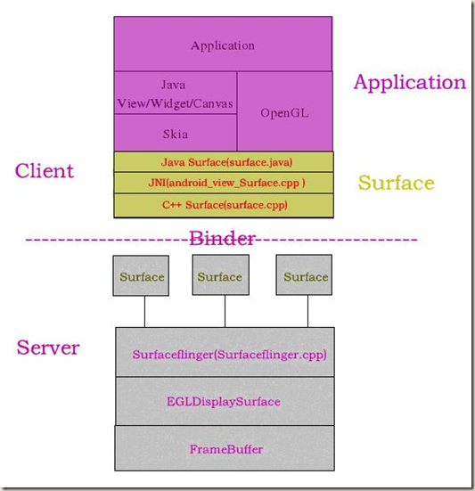

SurfaceFlinger作为一个server process，上层的应用程序（作为client）通过Binder方式与其进行通信。SurfaceFlinger作为一个thread，这里把它分为3个部分，如下：
1. Thread本身处理部分，包括初始化以及thread loop。
2. Binder部分，负责接收上层应用的各个设置和命令，并反馈状态标志给上层。
3. 与底层的交互，负责调用底层接口（HAL）。

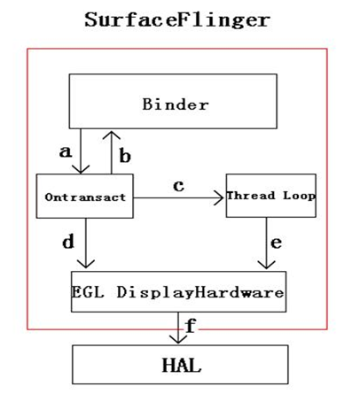

注释：
1. Binder接收到应用程序的命令（如创建surface、设置参数等），传递给flinger。
2. Flinger完成对应命令后将相关结果状态反馈给上层。
3. 在处理上层命令过程中，根据需要设置event（主要和显示有关），通知Thread Loop进行处理。
4. Flinger根据上层命令通知底层进行处理（主要是设置一些参数，Layer、position等）
5. Thread Loop中进行surface的合成并通知底层进行显示（Post buffer）。
6. DisplayHardware层根据flinger命令调用HAL进行HW的操作。

### 1. HWComposer/HWC

Android3.0引入，并不断升级，最初是为了确定当前可用硬件合成缓存的最有效方法。作为HAL，每个设备的实现是不同的，是由显示设备OEM进行实现的。主要职责之一是产生VSYNC信号。

Android 对Layer的合成包括2部分：在GPU中合成（OpenGL ES）和在display 的硬件中进行buffer的合成（hardware overlay 机制，主要是为了渲染快速变化的图形等）。Android 对两种合成机制的使用依靠Hardware Composer。

hardware overlay：典型场景下，屏幕上方的status bar，屏幕下方的navigation bar，以及应用本身的UI。每个layer都有自己独立的buffer。你可以通过逐步绘制每个layer到缓冲区里的方式来合成，最后将缓冲区的数据传递给显示硬件设备；或者，你也可以将每个layer数据分别传给显示硬件设备，然后告知显示硬件设备从不同的缓冲区中读取数据。显然后一种方法更有效率。

不同显示处理器之间的性能有巨大的差距。很多Overlay、layer被旋转或者合成，因此API很难准确表达在位置和遮盖上的限制。因此HWC模块是这样运作的：
1. SurfaceFlinger给HWC提供一份完整的layer列表，然后问，“你打算如何处理？”
2. HWC将每个Layer标记为overlay或者GLES composition，然后通知SurfaceFlinger
3. SurfaceFlinger来处理被标记为GLES合成的layer，将处理之后的数据传输给HWC，并且让HWC模块来处理剩下的工作。

当屏幕上没有任何东西变化时，overlay planes的效率不如GLES composition高。当overlay的内容中有很多透明的像素，或者重叠的layer在一起被混合时，这种差距尤其明显。在这种情况下，HWC会请求让GLES composition来处理部分或者全部的layer，并且保留混合后的buffer。如果Surfaceflinger又来请求混合相同的buffer时，HWC会直接显示之前保存的混合好的buffer。这么做将可以提升设备待机时间。

搭载了Android 4.4及以上的设备一般支持四层overlay planes。如果尝试混合更多的layer时，系统会使用GLES composition来处理其中的一部分；所以一个应用使用了多少layer会影响到系统的功耗和性能。可以通过`adb shell dumpsys SurfaceFlinger`这个命令来查看具体用了哪种方式。

overlay planes有另外一个重要的作用：这是显示DRM内容的唯一方法。受保护的DRM视频的buffer是无法被Surfaceflinger或者GLES驱动读取的，这意味着如果你使用GLES而不是HWC的话，你的视频将无法播放。

是否支持overlay/gles与显示硬件有关。

> 采用从Java层向下分析的顺序，SurfaceFlinger中显示更新的整体流程，以及与BufferQueue的配合，放到第四部分。

### 2. VSync同步

#### DispSync

Android中VSync信号分为硬件的和软件的，硬件的VSync是SF用来进行时序矫正的，主要通过DispSync调用HWC相关接口实现。软件VSync来自于DispSync，用来给SF的应用层进行同步。

#### DisplayEventReceiver

这个类（Java&Native）是让SF的客户端用来请求和接收VSync信号的，通过`requestNextVsync()`请求，通过给`getFd()`返回的Fd设置Callback来处理VSync信号。

RenderThread以及Choreographer都是通过这个类来与SurfaceFlinger进行VSync同步。

### 3. 其他类

FrameBufferSurface：SurfaceFlinger 处的本地帧缓存，实际意义上的显存。继承了ConsumerBase ，属于消费者。FrameBufferSurface拥有自己的BufferQueue，以及一个GraphicBufferAlloc图形缓存分配类。

DisplayDevice：抽象的显示设备，封装了用于渲染的Surface和HWComposer模块等，从而尽可能使得SurfaceFlinger只要和它打交道。DisplayDevice 的创建过程中创建了一个EGLSurface，它是一个供GLES使用的窗口缓冲区，为GLES提供一个绘制的地方。


## 三、hwui-硬件加速

### 0. 背景

传统软件的UI绘制是依靠CPU来完成的，硬件加速就是将绘制任务交由GPU来执行。Android系统负责硬件加速的模块主要是**HWUI**，如下图所示：


Android HWUI硬件加速的底层实现是基于`OpenGL ES`接口向GPU提交指令来完成绘制的。硬件加速的优势在于：

- 在高屏幕分辨率环境下（尤其对于4K高清电视而言），GPU UI绘制的帧率要高于CPU，同时能减轻CPU的负担，如果只使用CPU进行软绘制的话，效费比太低。
- GPU相比CPU更加适合完成光栅化、动画变换等耗时任务，在移动设备上比起使用CPU来完成这些任务，GPU会更加省电，带来的用户体验也会更佳。
- 现代移动GPU支持可编程管线，可以高效地开发应用界面的一些特效（吸入、渐变、模糊、阴影）。

实现的源码位于目录[android/platform/framework/base/libs/hwui]

从Androd 3.0(Honeycomb)开始，Android开始支持hwui（UI硬件加速）。到Android 4.0（ICS）时，硬件加速被默认开启。同时ICS还引入了DisplayList的概念（不是OpenGL里的那个），它相当于是从View的绘制命令到GL命令之间的“中间语言”。它记录了绘制该View所需的全部信息，之后只要重放（replay）即可完成内容的绘制。这样如果View没有改动或只部分改动，便可重用或修改DisplayList，从而避免调用了一些上层代码，提高了效率。Android 4.3（JB）中引入了DisplayList的defer操作，它主要用于对DisplayList中命令进行Batch（批次）和Merge（合并）。这样可以减少GL draw call和context切换以提高效率。

之后在Android 5.0（Lollipop）中又引入了RenderNode（渲染节点）的概念，它是对DisplayList及一些View显示属性的进一步封装。代码上，一个View对应一个RenderNode（Native层对应同名类），其中管理着对应的DisplayList和OffscreenBuffer（如果该View为硬件绘制层）。每个向WindowManagerService注册的窗口对应一个RootRenderNode，通过它可以找到View层次结构中所有View的DisplayList信息。在Java层的DisplayListCanvas用于生成DisplayList，其在native层的对应类为RecordingCanvas（在Android N前为DisplayListCanvas）。另外Android L中还引入了RenderThread（渲染线程）。所有的GL命令执行都放到这个线程上。渲染线程在RenderNode中存有渲染帧的所有信息，且还监听VSync信号，因此可以独立做一些属性动画。这样即便主线程block也可以保证动画流畅。引入渲染线程后ThreadedRenderer替代了Gl20Renderer，作为proxy用于主线程（UI线程）把渲染任务交给渲染线程。近期，在Android 7.0（Nougat）中又对hwui进行了小规模重构，引入了BakedOpRenderer, FrameBuilder, LayerBuilder, RecordingCanvas等类，用宏HWUI_NEW_OPS管理。

### 1. 概念

-    RecordingCanvas: 之前Java层的DisplayListCanvas对应native层的DisplayListCanvas。引入RecordingCanvas后，其在native层的对应物就变成了RecordingCanvas。和DisplayListCanvas类似，画在RecordingCanvas上的内容都会被记录在RenderNode的DisplayList中。
-    BakedOpRenderer: 顾名思义，就是用于绘制batch/merge好的操作。用于替代之前的OpenGLRenderer。它是真正用GL绘制到on-screen surface上的。
-    BakedOpDispatcher: 提供一系列onXXX（如onBitmapOp）和onMergedXXX（如onMergedBitmapOps）静态函数供replay时调用。这些dispatch函数最后一般都会通过GlopBuilder来构造Glop然后通过BakedOpRenderer的renderGlop()函数来用OpenGL绘制。
-    LayerBuilder: 用于存储绘制某一层的操作和状态。替代了部分原DeferredDisplayList的工作。对于所有View通用，即如果View有render layer，它对应一个FBO；如果对于普通View，它对应的是SurfaceFlinger提供的surface。 其中的mBatches存储了当前层defer后（即batch/merge好）的绘制操作。
-    FrameBuilder: 管理某一帧的构建，用于处理，优化和存储从RenderNode和LayerUpdateQueue中来的渲染命令，同时它的replayBakedOps()方法还用于该帧的绘制命令重放。一帧中可能需要绘制多个层，每一层的上下文都会存在相应的LayerBuilder中。在FrameBuilder中通过mLayerBuilders和mLayerStack存储一个layer stack。它替代了原Snapshot类的一部分功能。
-    OffscreenBuffer: 用于替代Layer类，但是设计上更轻量，而且自带内存池（通过OffscreenBufferPool）。
-    LayerUpdateQueue：用于记录类型为硬件绘制层的RenderNode的更新操作。之后会通过FrameBuilder将该layer对应的RenderNode通过deferNodeOps()方法进行处理。
-    RecordedOp: 由RecordedCanvas将View中的绘制命令转化为RecordedOp。RecordedOp也是DisplayList中的基本元素，用于替代Android N之前的DisplayListOp。它有一坨各式各样的继承类代表各种各样的绘制操作。BakedOpState是RecordedOp和相应的状态的自包含封装（封装的过程称为bake）。
-    BatchBase: LayerBuilder中对DisplayList进行batch/merge处理后的结果以BatchBase形式保存在LayerBuilder的mBatches成员中。它有两个继承类分别为OpBatch和MergingOpBatch，分别用于不可合并和可合并操作。

概括下它们和相关类的关系图如下：

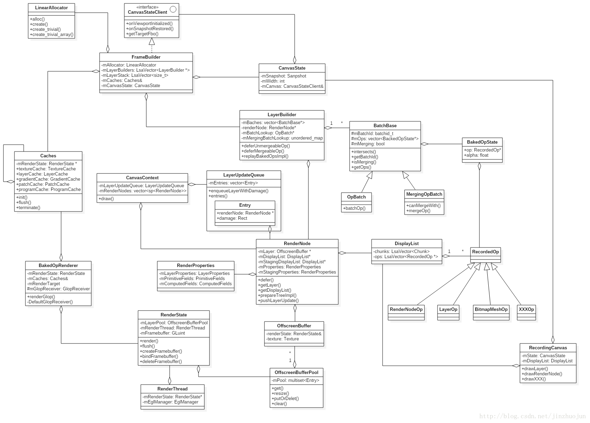

### 2. 渲染线程RenderThread


上图基于Android L，[ThreadedRenderer](https://android.googlesource.com/platform/frameworks/base/+/android-5.1.1_r2/core/java/android/view/ThreadedRenderer.java)的出现减轻了主线程的负担，可以更快的响应用户的操作。

#### 2.1 RenderThread启动

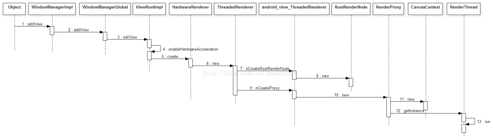

1. 每一个窗口对应一个ViewRootImpl，每个ViewRootImpl都对应唯一的一个ThreadedRenderer、一个RootRenderNode、一个RenderProxy对象。
2. 一个RenderProxy对象又对应一个CanvasContext对象。
3. 一个CanvasContext又对应一个OpenGLRenderer对象。
4. 一个拥有窗口的进程，必然有且只有一个RenderThread子线程。

#### 2.2 线程工作RenderThread.threadLoop()

```C++
// partially ignored
bool RenderThread::threadLoop() {
    setpriority(PRIO_PROCESS, 0, PRIORITY_DISPLAY);
    initThreadLocals();

    int timeoutMillis = -1;
    for (;;) {
        int result = mLooper->pollOnce(timeoutMillis);
        nsecs_t nextWakeup;
        {
            FatVector<RenderTask*, 10> workQueue;
            // Process our queue, if we have anything. By first acquiring
            // all the pending events then processing them we avoid vsync
            // starvation if more tasks are queued while we are processing tasks.
            while (RenderTask* task = nextTask(&nextWakeup)) {
                workQueue.push_back(task);
            }
            for (auto task : workQueue) {
                task->run();
                // task may have deleted itself, do not reference it again
            }
        }
        if (nextWakeup == LLONG_MAX) {
            timeoutMillis = -1;
        } else {
            nsecs_t timeoutNanos = nextWakeup - systemTime(SYSTEM_TIME_MONOTONIC);
            timeoutMillis = nanoseconds_to_milliseconds(timeoutNanos);
            if (timeoutMillis < 0) {
                timeoutMillis = 0;
            }
        }

        if (mPendingRegistrationFrameCallbacks.size() && !mFrameCallbackTaskPending) {
            drainDisplayEventQueue();
            mFrameCallbacks.insert(
                    mPendingRegistrationFrameCallbacks.begin(), mPendingRegistrationFrameCallbacks.end());
            mPendingRegistrationFrameCallbacks.clear();
            requestVsync();
        }

        if (!mFrameCallbackTaskPending && !mVsyncRequested && mFrameCallbacks.size()) {
            requestVsync();
        }
    }

    return false;
}
```
代码中这个while循环会将当前时间点及之前的所有本该触发调用的RenderTask全部执行run()。nextWakeup为下一个RenderTask的触发调用时间点。

mPendingRegistrationFrameCallbacks处理逻辑：
```
DispatchFrameCallbacks::run()
-->RenderThread::dispatchFrameCallbacks()
-->CanvasContext::doFrame()
```

mPendingRegistrationFrameCallbacks来源：
```
CanvasContext::doFrame()
-->CanvasContext::prepareTree()
-->RenderThread::postFrameCallback()
-->mPendingRegistrationFrameCallbacks.insert(callback)
```

如果有有效的Vsync信号，那么添加一个mFrameCallbackTask到TaskQueue队列中；如果没有有效的Vsync信号，那么在下面调用`requestVsync()`后，Vsync信号上来后会触发调用`drainDisplayEventQueue()`添加mFrameCallbackTask到TaskQueue队列中。mFrameCallbackTask这个RenderTask用来触发调用mPendingRegistrationFrameCallbacks的`doFrame()`函数，进一步分析发现mPendingRegistrationFrameCallbacks就是指向CanvasContext，也就是说mFrameCallbackTask会触发调用`CanvasContext::doFrame()`。

结合上面所说的mPendingRegistrationFrameCallbacks来源流程可以清楚的知道mFrameCallbackTask就是用来做动画的。

`initThreadLocals()`主要包括与SurfaceFlinger的EventThread线程建立起连接、构建出一个接收Vsync信号框架、通过`Looper.addFd()`添加Vsync信号处理函数`RenderThread::displayEventReceiverCallback()`等工作。流程如下：

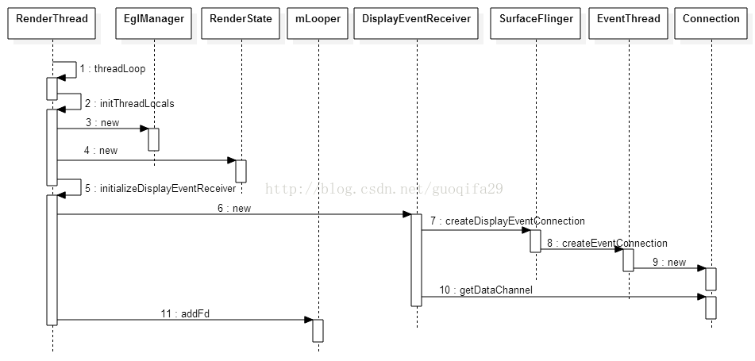

接收到Vsync信号，就会调用`displayEventReceiverCallback`静态函数，该函数继续调用`drainDisplayEventQueue()`。

相关类关系：

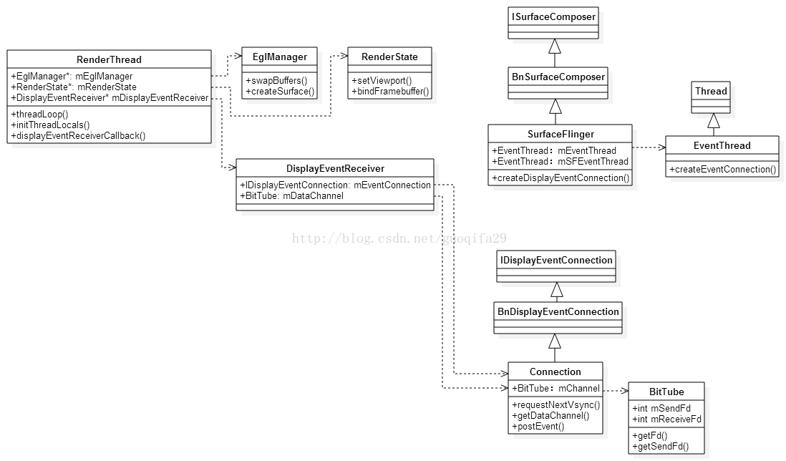

从前面那个while循环可以看出RenderThread线程最核心的功能便是"到点触发"调用一个个小任务RenderTask。

综上，Render Thread在运行时主要是做以下两件事情：

1. 执行Task Queue的任务，这些Task一般就是由MainThread发送过来的，例如，MainThread通过发送一个DrawFrameTask给RenderThread的TaskQueue中，请求RenderThread渲染窗口的下一帧。
2. 执行PendingRegistrationFrameCallbacks列表的IFrameCallback回调接口。每一个IFrameCallback回调接口代表的是一个动画帧，这些动画帧被同步到Vsync信号到来由RenderThread自动执行。具体来说，就是每当Vsync信号到来时，就将一个类型为DispatchFrameCallbacks的Task添加到RenderThread的TaskQueue去等待调度。一旦该Task被调度，就可以在RenderThread中执行注册在PendingRegistrationFrameCallbacks列表中的IFrameCallback回调接口了。

#### 2.3 绑定窗口对应的Surface到RenderThread

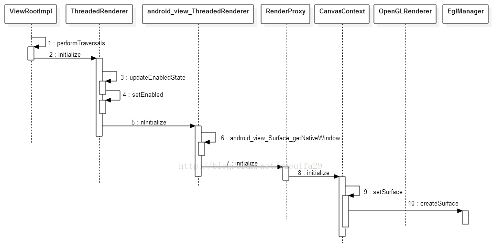

上图展示了创建一个窗口对应的Surface的过程，创建完成后，`setSurface()`通过Surface生成一个EglSurface，后面流程(RenderNode绘制)中EglSurface会被绑定到Render Thread的Open GL渲染上下文中（通过CanvasContext.mEglManager的成员函数`makeCurrent()`）。实际上就是通过EGL函数建立了从Open GL到底层OS图形系统的桥梁。Open GL是一套与OS无关的规范，不过当它在一个具体的OS实现时，仍然是需要与OS的图形系统打交道的。例如，Open GL需要从底层的OS图形系统中获得图形缓冲区来保存渲染结果，并且也需要将渲染好的图形缓冲区交给底层的OS图形系统来显示到设备屏幕去。Open GL与底层的OS图形系统的这些交互通道都是通过EGL函数来建立的。

### 3. Draw(native)

接下来从DisplayList(RenderNode)的构建和绘制两个阶段分析。

#### 3.1 RenderNode构建

通常App要完成一帧渲染，是通过ViewRootImpl的performTraversals()函数来实现。而它又可分为measure, layout, draw三个阶段。与绘制相关的是最后这步draw的流程。首先看DisplayList是怎么录制的。在ViewRootImpl::performDraw()中会调用draw()函数。当判断需要进行绘制时（比如有脏区域，或在动画中时），又如果硬件加速可用（通过ThreadedRenderer的isEnabled()），会进行下面的重绘动作。接下来根据是否有相关请求（如resize时）或offset是否有变化来判断是否要调用ThreadedRenderer的`invalidateRoot()`来标记更新RootRenderNode。

> 扯个题外话。和Android M相比，N中UI子系统中加入了不少对用户进行窗口resize的处理，主要应该是为了Android N新增加的多窗口分屏模式。比如当用户拖拽分屏窗口边缘时，onWindowDragResizeStart()被调用。它其中会创建BackdropFrameRenderer。BackdropFrameRenderer本身运行单独的线程，它负责在resize窗口而窗口绘制来不及的情况下填充背景。它会通过addRenderNode()加入专用的RenderNode。同时，Android N中将DecorView从PhoneWindow中分离成一个单独的文件，并实现新加的WindowCallbacks接口。它主要用于当用户变化窗口大小时ViewRootImpl对DecorView的回调。因为ViewRootImpl和WindowManagerService通信，它会被通知到窗口变化，然后回调到DecorView中。而DecorView中的相应回调会和BackupdropFrameRenderer交互。如updateContentDrawBounds()中最后会调用到了BackupdropFrmeRenderer的onContentDrawn()函数，其返回值代表在下面的内容绘制后是否需要再发起一次绘制。如果需要，之后会调用requestDrawWindow()。

回到ViewRootImpl::performDraw()函数，接下来，最重要的就是通过ThreadedRenderer的draw()来进行绘制。在这个draw()函数中，比较重要的一步是通过updateRootDisplayList()函数来更新根结点的DisplayList。

函数updateRootDisplayList()中的updateViewTreeDisplayList()会调到DecorView的updateDisplayListIfDirty()函数。这个函数主要功能是更新DecorView对应的RenderNode中的DisplayList。它返回的RenderNode会通过RecordingCanvas::drawRenderNode()函数将之作为RenderNodeOp加入到RootRenderNode的DisplayList中。函数updateDisplayListIfDirty()中首先判断当前View是否需要更新。如果不需要就调用dispatchGetDisplayList()让子View更新，然后直接返回。否则就是当前View的DisplayList需要更新。这里我们假设是第一次绘制，更新DisplayList的流程首先通过RenderNode的start()来获得一个用于记录绘制操作的Canvas，即DisplayListCanvas（在Android M中Java层由GLES20RecordingCanvas改为DisplayListCanvas，native层中的DisplayListRenderer改为DisplayListCanvas，Android N中native层中的DisplayListCanvas改为RecordingCanvas）。

**updateDisplayListIfDirty()**

接下去就是比较关键的步骤了。这里就要分几种情况了，一个View可以为三种类型（LAYER_TYPE_NONE, LAYER_TYPE_SOFTWARE, LAYER_TYPE_HARDWARE）中的一种。LAYER_TYPE_NONE为默认值，代表没有layer。LAYER_TYPE_SOFTWARE代表该View有软件层，以bitmap为back，内容用软件渲染。LAYER_TYPE_HARDWARE和LAYER_TYPE_SOFTWARE类似，区别在于其有硬件层，以FBO（Framebuffer object）为back，内容使用硬件渲染。如果硬件加速没有打开，它的行为和LAYER_TYPE_SOFTWARE是一样的。

如果当前View是软件渲染层（类型为LAYER_TYPE_SOFTWARE）的话，则调用buildDrawingCache()获得Bitmap后调用drawBitmap()将该Bitmap记录到DisplayListCanvas中。现在Android中都默认硬件渲染了，为什么还要考虑软件渲染层呢?一方面有些平台不支持硬件渲染，或app不启用硬件加速，另一方面有些UI控件不支持硬件渲染 。在复杂的View（及子View）在动画过程中，可以被绘制成纹理，这样只需要画一次。显然，在View经常更新的情况下并不适用。因为这样每次都需要重新用软件渲染，如果硬件渲染打开时还要上传成硬件纹理（上传纹理是个比较慢的操作）。类似的，硬件渲染层（LAYER_TYPE_HARDWARE）也是适用于类似的复杂View结构进行属性动画的场景，但它与LAYER_TYPE_SOFTWARE的层的区别为它对应FBO，可以直接硬件渲染生成纹理。因此渲染的过程中不需要先生成Bitmap，从而省去了上传成硬件纹理的这一步操作。

如果当前View对应LAYER_TYPE_NONE或者LAYER_TYPE_HARDWARE，下面会考查是否为没有背景的Layout。这种情况下当前View没什么好画的，会走快速路径。即通过dispatchDraw()直接让子View重绘。否则就调draw()来绘制当前View及其子View。注意View中的draw()有两个重载同名函数。一个参数的版本用于直接调用。三个参数的版本用于ViewGroup中drawChild()时调用。这里调的是一个参数的版本。

**draw(canvas)**

这个函数本质上就是将相应内容绘制到提供的DisplayListCanvas上。由于View是以树形层次结构组织的，draw()中会通过dispatchDraw()来更新子View的DisplayList。dispatchDraw()为对每个子View调用drawChild()。然后调用子View的draw()函数（这次就是上面说的draw()的三个参数的版本了）。这个版本的draw()函数里会更新其View的DisplayList，然后调用DisplayListCanvas的drawRenderNode()将该子view对应的RenderNode记录到其父view的DisplayList中去。这样便根据View的树型结构生成了DisplayList的树型结构。

其中调用onDraw()用于绘制当前View的自定义UI，它是每个View需要自定义的成员函数。比较典型地，在View的绘制函数中会调用canvas的drawXXX函数。比如canvas.drawLine()，它会通过JNI最后调到RecordingCanvas.cpp中的RecordingCanvas::drawLines()。RecordingCanvas中绝大多数的drawXXX系函数都是类似于这样，通过addOp()将一个RecordedOp的继承类存到其成员mDisplayList中。RecordedOp家庭成员很多，有不少继承类，每个对应一种操作。

各个View的DisplayList更新好后，回到udpateRootDisplayList()。如果发现RootRenderNode也需要更新，则先通过Java层的RenderNode::start()获得DisplayListCanvas，在这个Canvas上的动作都会被记录到DisplayList中，直到调用RenderNode.end()。然后为了防止对上下文状态的影响，用Canvas::save()和Canvas::restoreToCount()来生成临时的画布状态。再接下来就是通过drawRenderNode()将DecorView的RenderNode以RenderNodeOp的形式记录到RootRenderNode。

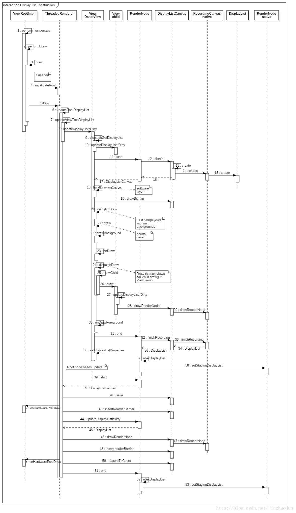

#### 3.2 RenderNode绘制

在ThreadedRenderer的draw()函数中构建完DisplayList后，接下来需要准备渲染了。首先通过JNI调用`nSyncAndDrawFrame()`调用到native层的`android_view_ThreadedRenderer_syncAndDrawFrame()`。其中将参数中的FrameInfo数组传到RenderProxy的mFrameInfo成员中。它是Android M开始加入用来细化hwui性能统计的。同时调用RenderProxy的`syncAndDrawFrame()`函数，并将创建的TreeObserver作为参数。函数`syncAndDrawFrame()`中即调用DrawFrameTask（这是RenderThread的TaskQueue中的特殊Task实例）的`drawFrame()`函数。继而通过`postAndWait()`往RenderThread的TaskQueue里插入自身（即DrawFrameTask）来申请新一帧的渲染。在RenderThread的`queue()`函数中会按Task的运行时间将之插入到适当的位置。接着`postAndWait()`函数中会block UI线程等待渲染线程将之unblock。

染线程处理这个DrawFrameTask时会调用到其run()函数：
```C++
void DrawFrameTask::run() {
    ...
    {
        ...
        canUnblockUiThread = syncFrameState(info);
        canDrawThisFrame = info.out.canDrawThisFrame;
    }

    // Grab a copy of everything we need
    CanvasContext* context = mContext;

    // From this point on anything in "this" is *UNSAFE TO ACCESS*
    if (canUnblockUiThread) {
        unblockUiThread();
    }

    if (CC_LIKELY(canDrawThisFrame)) {
        context->draw();
    }

    if (!canUnblockUiThread) {
        unblockUiThread();
    }
}
```
1.  首先通过DrawFrameTask::syncFrameState()函数将主线程的渲染信息（如DisplayList，Property和Bitmap等）同步到渲染线程。
    >- 这个函数中首先会处理DrawFrameTask中的mLayers。它是DeferredLayerUpdater的vector，顾名思义，就是延迟处理的layer更新任务。这主要用于TextureView。TextureView是比较特殊的类。它通常用于显示内容流，生产者端可以是另一个进程。中间通过BufferQueue进行buffer的传输和交换。当有新的buffer来到（或者有属性变化，如visibility等）时，会通过回调设置标志位(mUpdateLayer)并通过invalidate()调度下一次重绘。当下一次draw()被调用时，先通过`applyUpdate()->updateSurfaceTexture()->ThreadedRenderer::pushLayerUpdate()`，再调到渲染线程中的 `DrawFrameTask::pushLayerUpdate()`，将本次更新记录在DrawFrameTask的mLayers中。这样，在后面调用`DrawFrameTask::syncFrameState()`时会依次调用mLayers中的apply()进行真正的更新。这里调用apply()函数就会取新的可用buffer（通过`doUpdateTexImage()`函数），并将相关纹理信息更新到mLayer。
    >- 接下来通过CanvasContext的prepareTree()继而调用RenderNode的prepareTree()同步渲染信息。最后会输出TreeInfo结构，其中的prepareTextures代表纹理上传是否成功。如果为false，说明texture cache用完了。这样为了防止渲染线程在渲染过程中使用的资源和主线程竞争，在渲染线程绘制当前帧时就不能让主线程继续往下跑了，也就不能做到真正并行。
2.  在sync完数据后，DrawFrameTask::run()最后会调用CanvasContext::draw()来进行接下来的渲染。

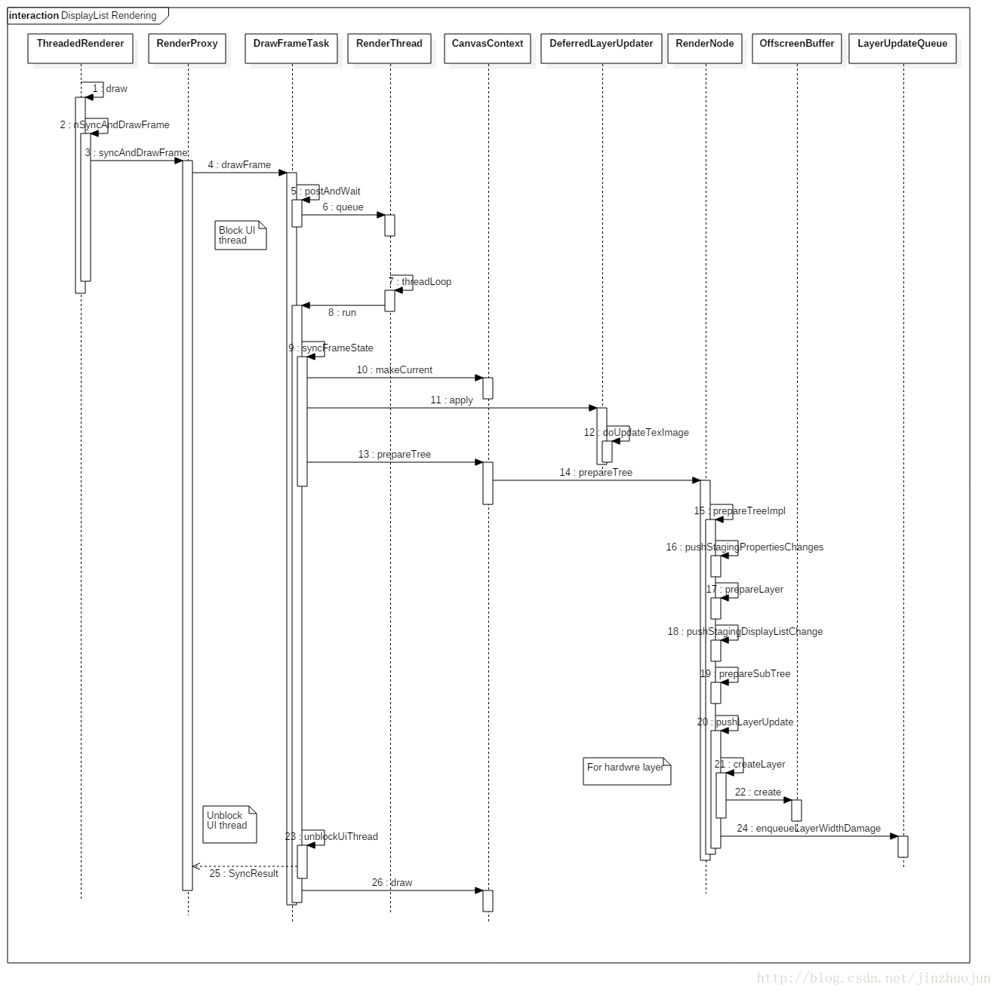

接下来瞄下`CanvasContext::draw()`里做了什么。先要小小准备下EGL环境，比如通过EglManager的`beginFrame()`函数，继而用`eglMakeCurrent()`将渲染context切换到相应的surface。然后EglManager的`damageFrame()`设定当前帧的脏区域（如果gfx平台支持局部更新的话）。接下来就是绘制的主体部分了。

```C++
    auto& caches = Caches::getInstance();
    FrameBuilder frameBuilder(dirty, frame.width(), frame.height(), mLightGeometry, caches);

    frameBuilder.deferLayers(mLayerUpdateQueue);
    mLayerUpdateQueue.clear();

    frameBuilder.deferRenderNodeScene(mRenderNodes, mContentDrawBounds);

    BakedOpRenderer renderer(caches, mRenderThread.renderState(),
            mOpaque, mLightInfo);
    frameBuilder.replayBakedOps<BakedOpDispatcher>(renderer);
    profiler().draw(&renderer);
    bool drew = renderer.didDraw();
```

1. 先得到Caches的实例。它是一个单例类，包含了各种绘制资源的cache。然后创建FrameBuilder。该类用于当前帧的构建。FrameBuilder的构造函数中又会创建对应fbo0的LayerBuilder。fbo0即对应通过SurfaceFlinger申请来的on-screen surface，然后将之放入layer stack（通过mLayerBuilders和mLayerStack两个成员维护）。同时还会在`initializeSaveStack()`函数中创建和初始化Snapshot。就像名字一样，它保存了渲染surface的当前状态的一个“快照”。每个Snapshot有一个指向前继的Snapshot，从而形成一个"栈"。每次调用`save()`和`restore()`就相当于压栈和弹栈。
2. 接下来`deferLayers()`函数处理LayerUpdateQueue中的元素。之前在渲染线程每画一帧前同步信息时调用`RenderNode::prepareTree()`会遍历DisplayList的树形结构，对于子节点递归调用`prepareTreeImpl()`，如果是render layer，在`RenderNode::pushLayerUpdate()`中会将该layer的更新操作记录到LayerUpdateQueue中。至于哪些节点是render layer。主要是根据之前提到的view类型（LAYER_TYPE_NONE/SOFTWARE/HARDWARE）。但会有一个优化，如果一个普通view满足`promotedToLayer()`定义的条件，它会被当做render layer处理。
3. 回到`deferLayers()`函数。这里就是把LayerUpdateQueue里的元素按逆序拿出来，依次调用`saveForLayer()`，`deferNodeOps()`和`restoreForLayer()`。`saveForLayer()`为该render layer创建Snapshot和LayerBuilder并放进mLayerStack和mLayerBuilders。而`restoreForLayer()`则是它的逆操作。Layer stack和canvas state是栈的结构。`saveForLayer()`和`restoreForLayer()`就相当于一个push stack，一个pop stack。这里核心的`deferNodeOps()`函数处理该layer对应的DisplayList，将它们按以下类型以batch的形式组织存放在LayerBuilder的mBatches成员中。其中同一类型中能合并的操作还会进行合并（目前只支持Bitmap, Text和Patch三种类型的操作合并）。Batch的类型有以下几种：
```C++
    // LayerBuilder.h
    enum {
        Bitmap,
        MergedPatch,
        AlphaVertices,
        Vertices,
        AlphaMaskTexture,
        Text,
        ColorText,
        Shadow,
        TextureLayer,
        Functor,
        CopyToLayer,
        CopyFromLayer,

        Count // must be last
    };
```
4. 下面看下deferNodeOps()函数里是怎么处理RenderNode的。DisplayList以chunk为单位组合RecordedOp。这些RecordedOp的opId代表它们的类型。根据这个类型调用receivers这个查找表（通过BUILD_DEFERABLE_OP_LUT构造）中的函数。它会调用FrameBuilder中相应的deferXXX函数（比如deferArcOp, deferBitmapOp, deferRenderNodeOp等）。这些deferXXX系函数一般会将RecordedOp用BakedOpState封装一下，然后会调用LayerBuilder的`deferUnmergeableOp()`和`deferMergeableOp()`函数将BakedOpState组织进mBatches成员。同时还有两个查找表mBatchLookup和mMergingBatchLookup分别用于不能合并的batch（OpBatch）和能合并的batch（MergingOpBatch）。它们分别用于查找特定类型的最近一个OpBatch或者MergingOpBatch。

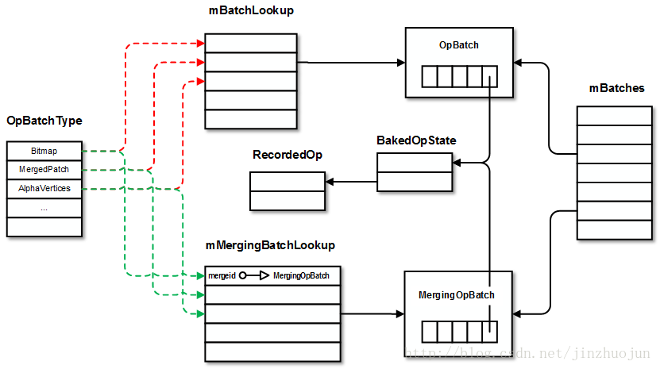

5. 回到CanvasContext::draw()函数，处理好layer后，下面得就是通过`FrameBuilder::deferRenderNodeScene()`函数处理FrameBuilder成员mRenderNodes中的RenderNode，其中包含了RootRenderNode（也可能有其它的RenderNode，比如backdrop和overlay nodes）。对于每个RenderNode，如果需要绘制则调用FrameBuilder的`deferRenderNode()`函数。这里和前面类似，会为之创建独立的Snapshot（Canvas渲染状态），`deferNodePropsAndOps()`根据RenderNode中的RenderProperties通过CanvasState设置一堆状态。如果该RenderNode对应是一个render layer，则将它封装为LayerOp（绘制offscreen buffer）并通过`deferUnmergeableOp()`加入batch。如果该RenderNode对应RenderProperties有半透明效果且不是render layer，则可以将该RenderNode绘制到一个临时的layer（称为save layer）。这是通过BeginLayerOp和EndLayerOp来记录的。正常情况下，还是通过`deferNodeOps()`来将RenderNode进行batch/merge。
6. 再次回到CanvasContext::draw()函数，下面终于要真得进行渲染了。首先创建BakedOpRenderer，然后调用`FrameBuilder::replayBakedOps()`函数并将BakedOpRenderer作为参数传进去。注意这是个模板函数，这里模板参数为BakedOpDispatcher。在`replayBakedOps()`函数中会构造两个用于处理BakedOpState的函数查找表。它们将BakedOpState按操作类型分发到BakedOpDispatcher的相应静态处理函数（onXXX或者onMergedXXX，分别用于非合并和合并的操作） 。
7. 之前已经在FrameBuilder中构造了LayerBuilder的stack。接下来，这儿就是按push时的逆序（z-order高到底）对其中的BakedOpState进行replay，因为下面的layer可能会依赖的上面layer的渲染结果。比如要把上面layer画在FBO上的东西当成纹理画到下一层layer上。对于layer（persistent或者temporary的），先在`BakedOpRenderer::startRepaintLayer()`中初始化相关GL环境，比如创建FBO，绑定layer对应OffscreenBuffer中的纹理，设置viewport，清color buffer等等。对应地，`BakedOpRenderer::endLayer()`中最相应的销毁和清理工作。中间调用`LayerBuilder::replayBakedOpsImpl()`函数做真正的replay动作。对于fbo0（即on-screen surface），也是类似的，只是把`startRepaintLayer()`和`endLayer()`换成`BakedOpRenderer::startFrame()`和`BakedOpRenderer::endFrame()`。它们的功能也是初始化和销毁GL环境。
8. 在replayBakedOpsImpl()函数中，会根据操作的类型调用前面生成的unmergedReceivers和mergedReceivers两个函数分发表中的对应处理函数。它们实质指向BakedOpDispatcher中的静态函数。这些函数`onXXXOp()`和`onMergedXXXOps()`函数大同小异，基本都是通过GlopBuilder将BakedOpState和相关的信息封装成Glop对象，然后调用`BakedOpRenderer::renderGlop()`，接着通过DefaultGlopReceiver调用`BakedOpRenderer::renderGlopImpl()`函数，最后在`RenderState::render()`中通过GL命令将Glop渲染出来。

### 4. 总结

总的来说，可以看到一个View上的东西要绘制出来，要经过多步的转化。

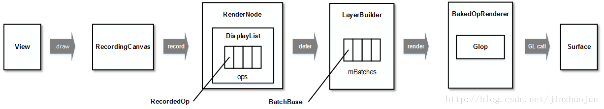

这样做有几个好处：第一、对绘制操作进行batch/merge可以减少GL的draw call，从而减少渲染状态切换，提高了性能。第二、因为将View层次结构要绘制的东西转化为DisplayList这种“中间语言”的形式，当需要绘制时才转化为GL命令。因此在View中内容没有更改或只有部分属性更改时只要修改中间表示（即RenderNode和RenderProperties）即可，从而避免很多重复劳动。第三、由于DisplayList中包含了要绘制的所有信息，一些属性动画可以由渲染线程全权处理，无需主线程介入，主线程卡住也不会让界面卡住。另一方面，也可以看到一些潜力可挖。比如当前可以合并的操作类型有限。另外主线程和渲染线程间的很多调用还是同步的，并行度或许可以进一步提高。另外[Vulkan](https://source.android.com/devices/graphics/implement-vulkan)的引入也可以帮助进一步榨干GPU的能力。

## 四、SurfaceFlinger刷新流程

### 1. Surface绘制

下面看一下普通的应用UI Surface绘制过程。

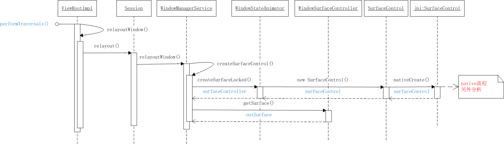

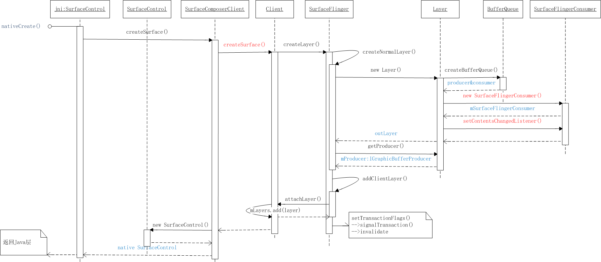

1. 如上图所示，在创建Surface/SurfaceControl过程中，SurfaceFlinger为对应UI在SF中代表--Layer绑定了一个BufferQueue，BufferQueue就是这时创建的。其中也会把其中生产者(IGraphicBufferProducer)与native Surface绑定。
2. 如第三部分，硬件加速“绑定窗口对应的Surface到RenderThread”的流程，即ViewRootImpl中的`ThreadedRenderer.initialize()`，最终CanvasContext中用Surface生成了EglSurface，如下：


3. 绑定完成后，调用`Surface.allocateBuffers()`为BufferQueue分配空间。

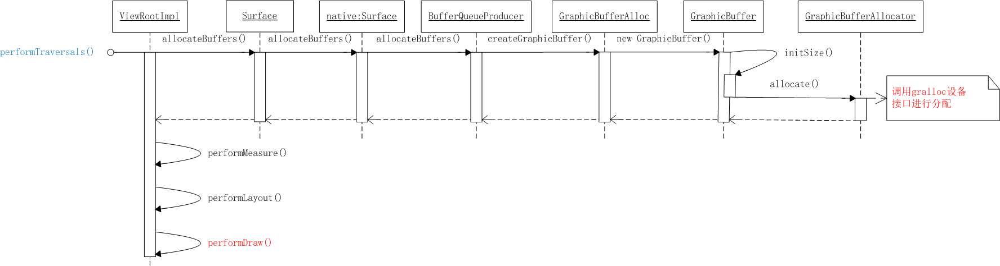

4. 在`performDraw()`中会通过hwui->OpenGL ES进行绘制，如第三部分"Draw(native)"所描述。在`CanvasContext.draw()`的绘制主体代码开始前，通过`mEglManager.beginFrame()->makeCurrent()`把对应的Surface/Buffer绑定到GLES的上下文，主体代码结束后，调用`mEglManager.swapBuffers()`将当前绘制的帧提交给SurfaceFlinger。

### 2. Surfaces合成显示

绘制完成Surface/Buffer被提交给SurfaceFlinger，合成逻辑是从SurfaceFlingerConsumer收到更新开始的。

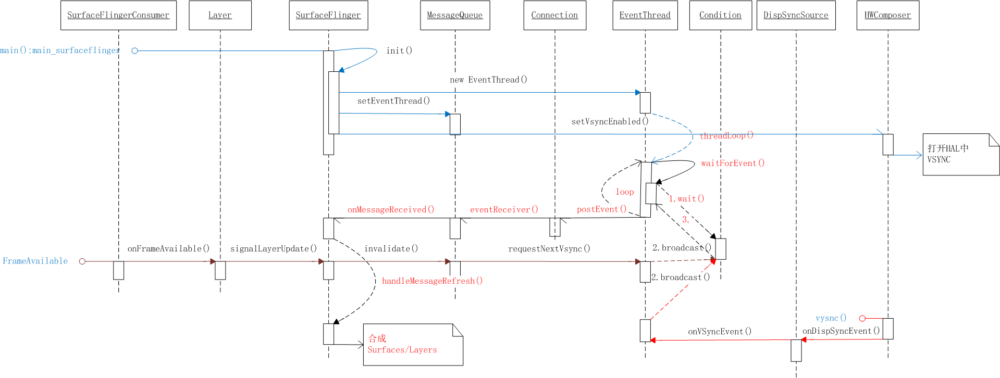

1. 图中蓝线是SurfaceFlinger初始化的过程，首先服务启动后调用`init()`初始化环境，其中消息监听相关的主要是MessageQueue(消息转发)和EventThread(进入一个循环中监听VSync事件)，这个时候也会打开VSync消息监听，另外在亮灭屏的时候也会开关VSync监听。
2. 途中棕色线是SurfaceFlingerConsumer收到Buffer数据更新后的逻辑，Layer将Buffer中数据放到一个队列中等待合成/显示，消息通知到SurfaceFlinger后，进入`invalidate->refresh`流程。
3. 右下角是VSync消息线，通知到EventThread，进入刷新流程。
4. 最终进入`SurfaceFlinger.handleMessageRefresh()`开始实际的合成和显示，关键代码如下。
```C++
    preComposition();
    rebuildLayerStacks();
    setUpHWComposer();
    doComposition();
    postComposition(refreshStartTime);
```

### 3. GraphicBuffer流程

GraphicBuffer先由App端作为生产者进行绘制，然后放入到BufferQueue，等待消费者取出作下一步的渲染合成。SurfaceFlinger作为消费者，会把每个层对应的GraphicBuffer取来生成EGLImageKHR对象。合成时对于GraphicBuffer的处理分两种情况。对于Overlay的层，SurfaceFlinger会直接将其buffer handle放入HWC的Layer list。对于需要GPU绘制的层（超出HWC处理层数或者有复杂变换的），SurfaceFlinger会将前面生成的EGLImageKHR通过glEGLImageTargetTexture2DOES()作为纹理进行合成。合成完后SurfaceFlinger又作为生产者，把GPU合成好的framebuffer的handle置到HWC中的FramebufferTarget中。HWC最后叠加Overlay层再往Display上扔，这时HWC是消费者。整个大致流程如图：

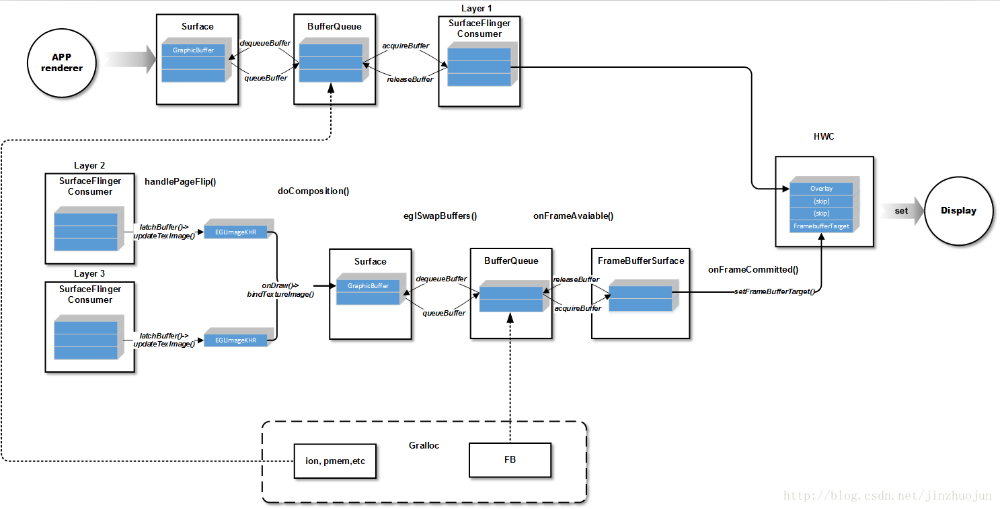

至此SurfaceFlinger刷新的整体流程分析完毕，还有一些细节的东西大家可自行看代码。
