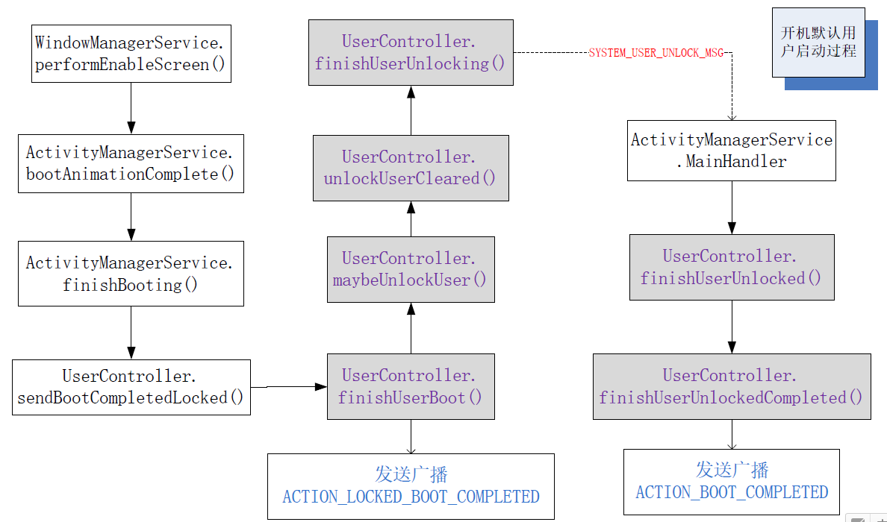

# Direct boot

### 名词

Direct Boot：直接启动
full disk encryption (FDE)：全盘加密
file-based encryption (FBE)：基于文件的加密
device encrypted (DE)：设备加密
credential encrypted (CE)：凭证加密
Trusted Execution Environment (TEE)：可信执行环境
Advanced Encryption Standard (AES)：高级加密标准，Rijndael加密法
XEX-based tweaked-codebook mode with ciphertext stealing (XTS)：[*翻译不了，自己wiki*](https://en.wikipedia.org/wiki/Disk_encryption_theory#XEX-based_tweaked-codebook_mode_with_ciphertext_stealing_.28XTS.29)
Embedded MultiMediaCard (eMMC)

## 导言

Android N之前版本使用FDE，所以加密的设备启动时，只能在用户输入密码以后去访问用户数据，导致闹钟、通话等基本功能都不能使用。Android N新加入了FBE支持，基于此提供的Direct Boot，允许应用获取系统加密状态，在用户解锁前进行有限的数据访问。

## 概念

可以缩短设备启动时间，让注册的应用具有有限的功能，即使在意外重启后也是。例如，当用户睡觉时如果加密的设备重启，那么注册的警报、消息和来电现在可以和往常一样继续通知用户。这也意味着重启后无障碍服务会立即可用。

在 Android N中，Direct Boot充分利用FBE，以针对系统和应用数据启用细化的加密策略。系统针对选定的系统数据和显式注册的应用数据使用设备加密存储。默认情况下，凭据加密存储可用于所有其他系统数据、用户数据、应用及应用数据。系统确保注册的设备加密的应用数据在解锁前可用。所有其他数据在用户确认锁定屏幕凭据进行解密前均不可用。 

当设备已开机但用户尚未解锁设备时，Android N 将在安全的“直接启动”模式下运行。 为支持此操作，系统为数据提供两个存储位置：
>- 凭据加密存储(CE)，这是默认存储位置，仅在用户解锁设备后可用。
>- 设备加密存储(DE)，该存储位置在“直接启动”模式下和用户解锁设备后均可使用。

默认情况下，应用不会在“直接启动”模式下运行。如果您有想要在此模式下运行的组件，您可以通过在Manifest中设置标记注册。重启后，系统通过广播 LOCKED_BOOT_COMPLETED激活注册的组件。对于需要在“直接启动”模式下运行的应用，常见的一些用例包括：
>- 已安排通知的应用，如闹钟应用。
>- 提供重要用户通知的应用，如短信应用。
>- 提供无障碍服务的应用，如 Talkback。

如果您的应用在“直接启动”模式下运行时需要访问数据，则使用设备加密存储。设备加密存储包含使用密钥加密的数据，仅在设备已成功验证启动后密钥才可用。

对于应使用与用户凭据（如 PIN 或密码）关联的密钥加密的数据，请使用凭据加密存储。凭据加密存储仅在用户已成功解锁设备后可用，直到用户再次重启设备。 如果用户在解锁设备后启用锁定屏幕，则不会锁定凭据加密存储。 

Android N的设备必须支持Direct boot，可以不支持FBE，但是不支持FBE的话，DE、CE存储一直时解锁状态。AOSP中已经提供了ext4格式分区的FBE支持。厂商可以定制支持的应用，但是通话服务、拨号盘和输入密码的输入法支持是强制要求的。

## 开发需知

Android在vold中提供了一个FBE的参考实现，用来管理Android上的存储设备和卷。同时vold中也新加了几个命令来支持多用户下的CE和DE的密钥管理。除了修改kernel中ext4加密的核心修改以外，锁屏和SystemUI都已经修改来支持FBE和Direct Boot，还有以下应用：

>- AOSP Dialer (packages/apps/Dialer)
>- Desk Clock (packages/apps/DeskClock)
>- LatinIME (packages/inputmethods/LatinIME)*
>- Settings App (packages/apps/Settings)*
>- SystemUI (frameworks/base/packages/SystemUI)*
>
>   加\*的应用在Manifest中还声明了defaultToDeviceProtectedStorage属性

可以通过`mangrep directBootAware`命令在AOSP代码中搜索其他的已经支持Direct Boot的应用和服务。

### 依赖

- **Kernel支持ext4加密**(配置项：EXT4_FS_ENCRYPTION)
- **Keymaster**支持HAL v1.0/v2.0，不支持Keymaster 0.3
- **Keymaster/Keystore以及Gatekeeper**必须在TEE中实现，以便保护DE密钥不被未授权OS(设备上刷的自定义系统)随意访问。
- **加密性能**：内核中用AES XTS加密，最低50MB/s的速度，保证足够好的用户体验。
- **Hardware Root of Trust**和绑定到keymaster初始化的**Verified Boot**也要支持，这是用来保护DE凭据不被未授权OS访问。

> 设备加密策略会应用到目录及其所有子目录，所以厂商要限制放到OTA和放置解密密钥的目录中的内容。大多数数据都应该放倒CE存储，而不是DE存储。

CTS encryption tests可以验证这些功能是否正常。

### 请求在直接启动时运行

应用必须先向系统注册其组件，然后才能在“直接启动”模式下运行或访问设备加密存储。 应用通过将组件标记为“加密感知”来注册系统。 若要将您的组件标记为加密感知，请在清单中将 `android:directBootAware`属性设为 true。

当设备重启后，加密感知组件可以注册接收来自系统的`LOCKED_BOOT_COMPLETED`广播消息。 此时设备加密存储可用，您的组件可以在“直接启动”模式下执行需要运行的任务，例如触发已设定的闹铃。

以下代码段展示如何将`BroadcastReceiver`注册为加密感知并在应用清单中为 `LOCKED_BOOT_COMPLETED`添加 Intent 过滤器：
```xml
<receiver
  android:directBootAware="true" >
  ...
  <intent-filter>
    <action android:name="android.intent.action.LOCKED_BOOT_COMPLETED" />
  </intent-filter>
</receiver>
```
在用户解锁设备后，所有组件均可访问设备加密存储以及凭据加密存储。 


### 存储数据到设备加密存储

在Manifest中设置`defaultToDeviceProtectedStorage`属性为true，可以默认把应用数据存储到DE存储(系统默认为CE存储)，该属性值开放给系统应用。使用一定要非常小心，不能把用户个人信息存储到DE存储中。对应用可以使用下面两个方法来访问CE存储。
```
Context.createCredentialProtectedStorageContext()
Context.isCredentialProtectedStorage()
```
当系统默认存储到DE设备时，可以用下面的属性强制存储到CE设备。
```xml
<application android:forceDeviceEncrypted=”true”>
```

### 访问设备加密存储

要访问设备加密存储，请通过调用`Context.createDeviceProtectedStorageContext()`创建另一个 Context 实例。使用此上下文执行的所有存储 API 调用均访问设备加密存储。 以下示例访问设备加密存储并打开现有应用数据文件：
```Java
Context directBootContext = appContext.createDeviceProtectedStorageContext();
// Access appDataFilename that lives in device encrypted storage
FileInputStream inStream = directBootContext.openFileInput(appDataFilename);
// Use inStream to read content...
```
`Context.isDeviceProtectedStorage()`判断当前Context是否是设备加密存储实例。仅针对在“直接启动”模式下必须可访问的信息使用设备加密存储。请勿将设备加密存储用作通用加密存储。对于专有用户信息，或在“直接启动”模式下不需要的加密数据，请使用凭据加密存储。

使用`Context.moveSharedPreferencesFrom()`和`Context.moveDatabaseFrom()`可以在凭据加密存储和设备加密存储之间迁移首选项和数据库数据。不应将专有用户信息（如密码或权限令牌）迁移到设备加密存储。 

### 接收用户解锁通知

重启后一旦用户解锁了设备，您的应用即可切换至访问凭据加密存储，并使用依赖用户凭据的常规系统服务。

为了在重启后用户解锁设备时收到通知，请从一个正在运行的组件注册`BroadcastReceiver`以侦听 `ACTION_USER_UNLOCKED`消息。 或者可以接收现有`ACTION_BOOT_COMPLETED`消息，该消息现在表明设备已启动，且用户已解锁设备。

您可以通过调用`UserManager.isUserUnlocked()`直接查询用户是否已解锁设备。

### 调试

使用以下 adb shell 命令启用“直接启动”模式：
```shell
$ adb reboot-bootloader
$ fastboot --wipe-and-use-fbe
```
另外提供模拟直接启动模式，可以在测试设备上切换模式。 模拟模式应仅在开发期间使用，否则可能导致数据丢失。 若要启用模拟直接启动模式，请在设备上设置锁定模式，如果在设置锁定模式时系统提示安全启动屏幕，则选择“No thanks”，然后使用以下 adb shell 命令：
```shell
$ adb shell sm set-emulate-fbe true
```
若要关闭模拟直接启动模式，请使用以下命令：
```shell
$ adb shell sm set-emulate-fbe false
```
> 使用这些命令会导致设备重启。

`ro.crypto.state`：加密状态
`ro.crypto.type`：加密类型，FBE对应值为file

userdebug版本给User 0设置锁屏以后，执行`adb shell su`，再进入`/data/data`查看是否有加密的文件名，如果不存在证明FBE未打开或者异常。 

## 框架启动流程

手机FBE加密后，冷启动到SystemServer是没有区别的(官方说明是：Direct boot模式下，操作系统可以全功能运行，但不允许访问私有应用数据，只能运行经过更新、可支持直接启动功能的应用)，这部分也不是主要关注点。

1. SystemServer进程被zygote进程创建后，在SystemServer的run方法中会启动系统所需的关键服务：
```
private void run() {
    ...
    startBootstrapServices();
    startCoreServices();
    startOtherServices();
    ...
}
```
2. 在startBootstrapServices函数中将启动ActivityServiceManager以及UserManagerService，UserManagerService将User 0初始化(状态设置为STATE_BOOTING)
```
private void startBootstrapServices() {
    ...
    mActivityManagerService = mSystemServiceManager.startService( ActivityManagerService.Lifecycle.class).getService();       
    ...
    mSystemServiceManager.startService(UserManagerService.LifeCycle.class);
    ...
}
```
3. 在startOtherServices中调用systemReady()：
```
private void startOtherServices() {
    ...
    mActivityManagerService.systemReady(new Runnable() {
        ...
        startSystemUi(context);
        ...
    });
    ...
}
```
4. 在ActivityManagerService的systemReady函数中：
```
public void systemReady(final Runnable goingCallback) {
    ...
    mUserController.onSystemReady();
    ...
    goingCallback.run(); #1
    ...
    mSystemServiceManager.startUser(currentUserId);
    ...
    //MATCH_DIRECT_BOOT_AWARE #2
    startPersistentApps(PackageManager.MATCH_DIRECT_BOOT_AWARE);
    ...
    // Start Home
    startHomeActivityLocked(currentUserId, "systemReady");
    ...
}
```
5. `#1`启动SystemUI，`#2`启动具有Persistent和directBootAware标签的应用。
6. 开机动画退出到退出Direct boot的流程如下：


判断是否处于Direct Boot/用户锁定模式，通过下面的方法：
```
UserManager.isUserUnlockingOrUnlocked(userHandle);
```

> 如果用户设置了密码，则通过LockSettingsService中调用UserController的unlockUser
来解锁用户，当用户解锁后，系统进入正常模式。

> `PackageManagerService.updateFlags()`，PackageManager使用的所有查询/获取方法中都会通过这个方法进行过滤，保证在Direct Boot模式下返回结果中不会包含`directBootAware=false`的应用，这样就能保证未注册的Activity、Service、BroadcastReceiver、ContentProvider不会启动或者被使用。

## 深层支持

### FBE

在fstab中`userdata`分区最后一列添加无参数的`fileencryption`标记，可以打开FBE。 [例子](https://android.googlesource.com/device/lge/bullhead/+/nougat-release/fstab_fbe.bullhead)

密钥的生成以及内核keyring的管理是由vold处理的。第一次启动时，User 0的密钥是在启动流程早期生成的，到init的on-post-fs阶段完成时，Keymaster必须已经能够处理请求，data区挂在之前Keymaster必须启动，Nexus中是通过脚本Block实现的。

Ext4加密是应用到目录级别的，设备userdata分区第一次创建时是init脚本应用这些加密策略的，脚本中会触发User 0 CE和DE密钥的生成，也会定义哪些目录会用这些密钥加密。再有其他用户创建时，新生成的密钥是存储在keystore中的，他们的凭据和设备存储也会创建并进行加密。

目前AOSP中实现：

- 文件内容用 AES-256 XTS模式加密
- 文件名字用 AES-256 CBC-CTS模式加密

AOSP目前的实现是硬编码在:
```
/system/extras/ext4_utils/ext4_crypt_init_extensions.cpp
```
可以在这个文件中添加例外目录，不进行加密，方法是加到`directories_to_exclude`中，如果做了这样的修改，厂商应该添加这样的SELinux策略：只给必须使用未加密目录的应用相应的访问权限，所有未受信任的应用都应该被排除在外。目前已知的唯一场景就是支持传统OTA相关的功能。

### OTA升级

recovery分区不能访问DE存储中的data分区，支持FBE的设备Google官方强烈建议通过所谓的A/B系统升级实现OTA。正常操作时的OTA升级，recovery是不需要访问加密磁盘的data区的，但是传统OTA需要recovery访问userdata中的OTA文件。可以这么实现：

- 在userdata创建一个顶级目录，比如misc_ne
- 把这个目录添加到加密例外列表中
- 用这个创建一个目录用来放OTA升级包
- 添加SELinux策略来控制访问这个目录的应用以及放入其中的内容

然后就可以在对应目录中存储OTA升级包。

### FDE

全盘加密就是用一个密钥把设备中所有用户数据加密，是从Android 4.4开始引入的，Android 5.0开始支持快速加密(支持ext4、f2fs)。全盘加密基于dm-crypt，所以支持块设备，也就是只有eMMC存储和类似在kernel表现为块设备的闪存，NAND存储是不支持的。

全盘加密设备启动时，先加载一个临时文件系统到/data以便启动UI界面给用户进行解密、进度条或其他提示。然后系统要杀死所有访问该临时文件系统的进程，然后重启到真正的data分区。所有进程必须属于以下组之一：core、main和late_start。

- core: 启动后不会关闭
- main: 关闭并在输入磁盘密码后重启
- late_start:  /data解密并加载后才会启动

`vold.decrypt`被设置成各种字串来触发这些动作，杀掉或者重启服务的init命令：

- class_reset: 停止服务但是允许通过class_start重启
- class_start: 重启服务
- class_stop: 停止服务并添加SVC_DISABLED标记，停掉的服务不会响应class_start

常规的启动流程如下：

- 检测到加密设备
- 挂载tmpfs
- 启动framework要求用户输入密码
- 输入成功后重新挂载data，启动

framework启动后遇到以下错误会要求用户恢复出厂设置：

- 密码匹配但是无法解密数据
- 用户输错密码30次

相关的加密以及加密后启动流程，可以查看[官方文档](https://source.android.com/security/encryption/full-disk.html#how_android_encryption_works)
