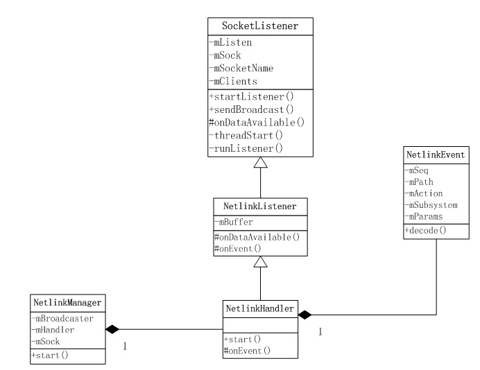
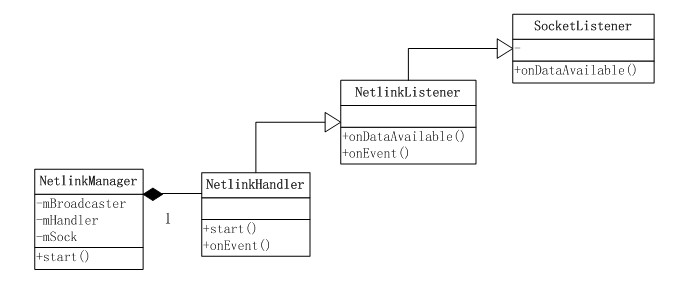
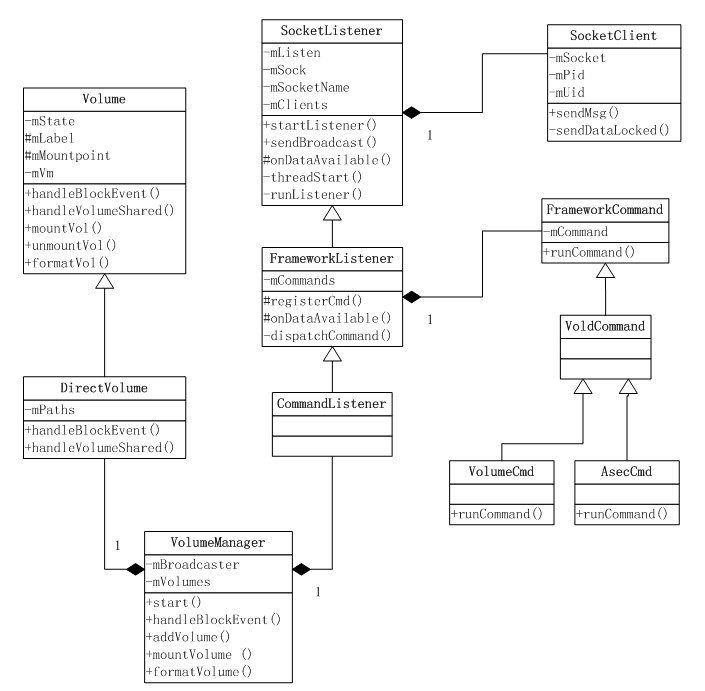
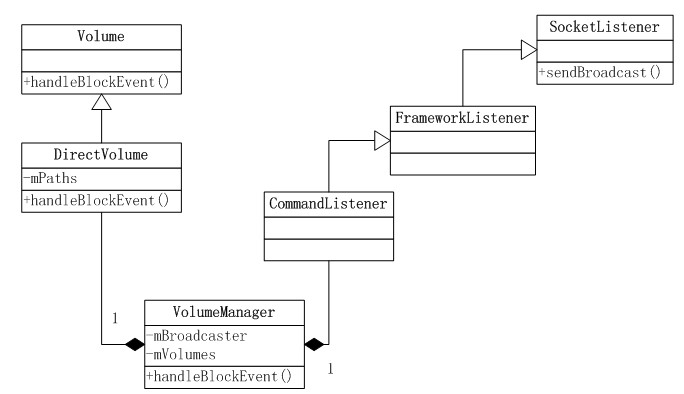
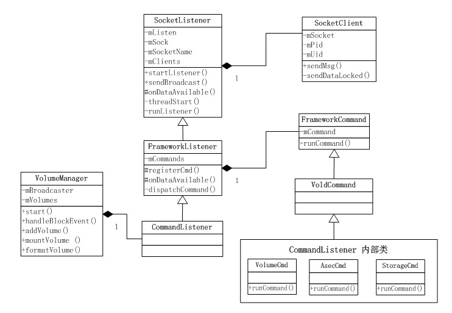

# vold

## 导言

vold：管理和控制Android平台外部存储设备，包括SD插拨、挂载、卸载、格式化等。


## vold启动

`system/vold/vold.rc`(Android N)/`system/core/rootdir/init.rc`(< Android N)中定义了vold服务：
```
service vold /system/bin/vold
    class core
    socket vold stream 0660 root mount
    socket cryptd stream 0660 root mount
    ioprio be 2
```
`system/core/rootdir/init.rc`中定义了vold服务的启动时机：
```
on post-fs-data
    start vold
```

### vold进程执行过程

```c++
// /system/vold/main.cpp
int main()
{
        VolumeManager *vm;
        CommandListener *cl;
        NetlinkManager *nm;
        //创建vold设备文件夹
        mkdir("/dev/block/vold", 0755);
        ...
        //初始化Vold相关的类实例 single
        vm = VolumeManager::Instance();
        nm = NetlinkManager::Instance();

        //CommandListener 创建vold socket监听上层消息
        cl = new CommandListener();
        vm->setBroadcaster((SocketListener *) cl);
        nm->setBroadcaster((SocketListener *) cl);

        //启动VolumeManager
        vm->start();

        //根据配置文件/etc/fstab.xxx 初始化VolumeManager
        process_config(vm);

        //启动NetlinkManager socket监听内核发送uevent
        nm->start();

        //向/sys/block/目录下所有设备uevent文件写入“add\n”,
        //触发内核sysfs发送uevent消息
        coldboot("/sys/block");

        //启动CommandListener监听vold socket
        cl->startListener();

        // Eventually we'll become the monitoring thread
        while(1) {
            sleep(1000);
        }

        exit(0);
}
```

### fstab文件

fstab存放的是系统中的文件系统信息。当正确设置了该文件，就可以通过mount /dirname命令来加载一个文件系统，每个文件系统都对应一个独立的行，每行中的字段都有空格或tab键分开。同时fsck、mount、umount的等命令都利用该文件，系统可能有多个fstab文件，如：recovery.fstab、vold.fstab、fstab.qcom等。

Android典型的fstab(Android 4.3+)如下：
```
#<src>     <mnt_point>  <type>  <mnt_flags and options>  <fs_mgr_flags>
/dev/block/bootdevice/by-name/system  /system     ext4
          ro,barrier=1,discard   wait,verify
/dev/block/bootdevice/by-name/userdata  /data      ext4
          nosuid,nodev,barrier=1,noauto_da_alloc,discard
          wait,forceencrypt=footer
/devices/soc/7864900.sdhci/mmc_host*  /storage/sdcard1   vfat
          nosuid,nodev
          wait,voldmanaged=sdcard1:auto,noemulatedsd,encryptable=footer
/devices/soc/78db000.usb/msm_hsusb_host* /storage/usbotg  vfat
          nosuid,nodev    wait,voldmanaged=usbotg:auto
/dev/block/bootdevice/by-name/config  /frp  emmc   defaults   defaults
/dev/block/bootdevice/by-name/misc    /misc emmc   defaults   defaults
```
一共有5列，分别对应源设备、挂载点、文件系统类型、挂载标记和选项、fs_mgr标记。
- mnt_flags：Vold忽略此列，可以设置为defaults
- fs_mgr_flags：标准fstab行中如果不包含`voldmanaged=`标记Vold也会忽略。这个标记后面要跟一个label和分区号，或者`auto`。 比如：`voldmanaged=sdcard:auto`，其他可能的标志有：`nonremovable`，` encryptable=sdcard`，`noemulatedsd`和 `encryptable=userdata`。

## 存储

### 配置手机存储

framework及应用层与外部存储交互都是通过MountService，由于Android M上不再使用`frameworks/base/core/res/res/xml/storage_list.xml`这个文件，所以分两部分讨论：

1. Android 5.x及以前版本：通过`storage_list.xml`配置设备的外置存储。`<StorageList>`根节点下包含几个`<storage>`，其中一个要设置为primary。`<storage>`可以包含的属性有：
```
mountPoint：文件系统挂载点
storageDescription：存储的描述
primary：是否默认存储
removable：是否可移除存储设备，比如插入的SD卡
emulated：是否使用内置存储模拟的，比如用的FUSE方式
mtp-reserve：MTP模式保留多少MB空闲空间，emulated为true时可用
allowMassStorage：是否允许作为大容量存储设备
maxFileSize：允许的最大文件大小/MB
```
> FUSE实现在`system/core/sdcard`，定义在设备定义的init.rc
2. Android M+：通过设备定义的fstab来配置存储，存储设备根据vold检测到的动态配置。FUSE是根据需要动态从vold fork出来的。

[官方示例说明](https://source.android.com/devices/storage/config-example.html)

### 便携式存储

Android M开始加入这个概念，表示可移除的存储设备，而且是短期可用的，所以应用不能将关键数据存储在上面。不提供文件自动扫描机制，由于安装和隐私原因不允许直接访问，第三方应用只能通过DocumentsProvider访问。

fstab中声明了`voldmanaged`属性的存储默认认为是便携的，除非定义了另一个属性`encryptable=userdata`。Android在挂载设备前用blkid检测分区格式，如果不支持的话用户可以选择进行格式化。

### Adoptable存储

Android一直支持外置存储设备，但由于不确定性和不安全，所以一直只用作简单的文件存储。Adoptable(暂译为可收养)存储是从Android M加入的，允许将可移除外置存储收养，然后像内置存储一样使用。当用户插入新的SD卡时，会有提示让用户选择收养，还是作为便携存储。传统的方式使用MBR，所以最大支持2TB，收养方式使用GPT，可以达到约9ZB。

在fstab中`fs_mgr_flags`字段添加`encryptable=userdata`属性表示一个文件系统为Adoptable存储。被收养后设备中的内容被擦除，然后写一个GUID分区表，其中定义两个分区：
- 一个小的空的android_meta分区（暂未使用），GUID为`19A710A2-B3CA-11E4-B026-10604B889DCF`
- 一个大的android_ext分区使用dm-crypt加密，格式化为ext4或f2fs格式（根据kernel的支持）。GUID为`193D1EA4-B3CA-11E4-B075-10604B889DCF`

被收养的存储被格式化并加密，跟单个设备绑定，所以可以用来存储应用和隐私数据。应用可以在/data和收养的存储之间移动。被收养的存储内容就像data的镜像，包括SELabels等。

每个收养的存储根据它的GUID随机生成一个key，存储在内置存储中，这样就能保证SD卡和内置存储一样安全。分区会调用dm-crypt使用aes-cbc-essiv:sha256算法和128-bit密钥进行加密。

## vold中消息传递

### NetlinkManager

> Netlink 是一种特殊的 socket；
> Netlink 是一种在内核与用户应用间进行双向数据传输的非常好的方式，用户态应用使用标准的socket API 就可以使用 Netlink 提供的强大功能；
> Netlink是一种异步通信机制，在内核与用户态应用之间传递的消息保存在socket缓存队列中。

NetlinkManager模块接收从Kernel发送的Uevent消息，解析转换成NetlinkEvent对象；再将此NetlinkEvent对象传递给VolumeManager处理。

类图


Netlink消息处理

在消息循环中调用`onDataAvailable()`处理消息，将接收的Uevent数据转化成NetlinkEvent数据，调用`onEvent()`处理，NetlinkHandler将过滤号的事件给`VolumeManager.handleBlockEvent()`处理。

### VolumeManager

管理所有挂载的设备节点以及相关操作执行，作为kernel和Java framework的中介。

类图


NetlinkManager构造的NetlinkHandler：Kernel与Vold通信。
VolumeManager构造的CommandListener：Native Vold与Framework MountService通信。

Volume的状态变化消息，通过CommandListener通知Framework层。


### CommandListener

CommandListener监听Socket，使Vold与Framework层进行进程通信。

类图


CommandListener实例的构造函数如下，可以看出其中提供了不同的命令集合，可以进行扩展：
```C++
CommandListener::CommandListener() :
                FrameworkListener("vold", true) {
    //注册Framework发送的相关命令 Command模式
    registerCmd(new DumpCmd());
    registerCmd(new VolumeCmd());
    registerCmd(new AsecCmd());
    registerCmd(new ObbCmd());
    registerCmd(new StorageCmd());
    registerCmd(new XwarpCmd());
    registerCmd(new CryptfsCmd());
}
```

CommandListener启动的线程监听Socket消息，接收到的消息处理流程：
```
onDataAvailable()->dispatchCommand()->runCommand()
```