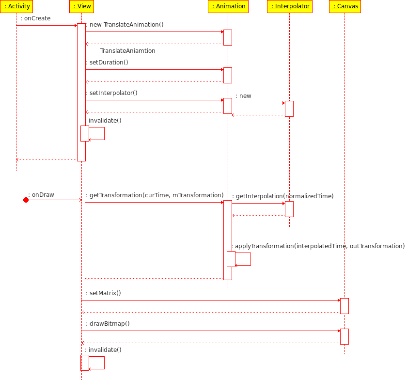

####一、视图动画(View Animation)

视图动画系统用来创建View上的补间动画。补间动画用起始/结束位置、大小、旋转以及其他常用的动画信息来计算动画。

补间动画显示一系列简单的View对象形变，如位置、大小、旋转和透明等。相关的API包含在android.view.animation包中。

视图动画指令可以在xml或代码中定义，建议定义到xml，因为易于阅读，复用和替换。动画的xml文件放在res/anim目录，文件只能有一个根元素，可以是`<alpha>, <scale>, <translate>, <rotate>`, 插值器元素或者<set>，<set>中可以包含一组元素，包含它本身。默认所有的动画指令同时播放。

同一个对象可以有多个形变，这些形变可以是序列的，也可以是同步的，关键在于设置的起始时间。

可以给一个形变设置Interpolator来确定如何变化，Android包含几个预定义的变速曲线，如AccelerateInterpolator等。

startAnimation()用来启动动画，也可以用setStartTime()设置启动时间，具体用法请查看SDK。

####二、属性动画(Property Animation)

#####2.1 简介

属性动画几乎可以让任何东西动起来。不管是不是画到屏幕的对象，都可以定义一个它的属性随时间改变的动画。属性动画就是让对象的属性值在特定时间段内变化，比如对象的位置等。

属性动画可以定义以下动画特征：
1. 持续时间：默认300ms
2. 时间插值：属性值随播放时间的变化曲线/方法
3. 重复次数和方式：重复播放，播放时是否交叉正向反向播放
4. 绘制器集合：对一个对象组合多种动画同时/先后播放
5. 帧刷新延迟：设置帧刷新频率，默认是10ms

ValueAnimator对象跟踪动画的时序，比如动画已经播放的时间，以及动画变化到当前时刻的属性值。ValueAnimator中封装了一个定义动画插值的TimeInterpolator，以及一个定义如何计算变化的属性值的TypeEvaluator。

要启动动画，首先创建一个ValueAnimator，给它设置随着时间变化的起始和结束属性值，然后调用start()开始播放动画；

在整个动画中，ValueAnimator基于动画持续时间和已播放时间计算播放比例(0->1)。当ValueAnimator计算好比例后，调用当前设置的TimeInterpolator计算插值比例。

计算好插值比例后，ValueAnimator调用合适的TypeEvaluator基于这个比例计算当前的属性值。

属性动画的API大部分在android.animation中，插值器在android.view.animation中，这个包是视图动画的API，这些插值器也是视之前版本为视图动画定义的，不过可以共用。

**属性动画和视图动画的差别：**
>视图动画只能应用于View对象，而且只有View的几个方面可以进行动画，比如缩放和旋转，但不能改变背景颜色。

>视图动画只能修改显示出来的内容，并未修改View本身，比如在屏幕上移动一个按钮，但实际按钮的可点击区域没有变化。

>另一方面视图动画构建简单，编码少，如果可以满足开发要求，没必要使用属性动画。

####2.2 Animators/Evaluators/Interpolators

- Animator类提供创建动画的基本架构，但需要扩展之后才可以用于实际，因为它只提供了最小的实现，下面是一些它的子类。
- Evaluators用来定义如何计算对应的属性值，通过Animator提供的时间轴，动画起始值，计算出变化的属性值。常用的有IntEvaluator、FloatEvaluator、ArgbEvaluator，还有TypeEvaluator接口。这个接口允许你扩展出自己的Evaluator，其实只有一个方法要实现evaluate()，返回合适的属性值就可以了。
- Interpolators定义特定的数据如何随时间变化。如线性、加速等。常用的有AccelerateInterpolator、LinearInterpolator、AnticipateInterpolator、BounceInterpolator、CycleInterpolator等。也可以通过扩展TimeInterpolator接口自定义Interpolator，重写getInterpolation(float played)，根据传入的播放时间百分比，返回一个属性值改变的百分比。

#####1. ValueAnimator
属性动画的主时间引擎，同时计算变化的属性值。包含所有计算动画数据的核心功能，像动画时间轴，是否重复播放，接收更新时间的监听以及设置自定义计算类型的能力。属性动画由两部分：计算动画数据以及把新的属性值设置给对象。后者的逻辑需要开发者自己处理。

可以通过工厂方法ofInt()、ofFloat()和ofObject()获取ValueAnimator对象。

下面的代码启动了一个1000ms的动画，属性值从0到1，调用start后启动；
```Java
ValueAnimator animation = ValueAnimator.ofFloat(0f, 1f);
animation.setDuration(1000);
animation.start();
```
下面的动画自定义了一个Evaluator，属性值从startPropertyValue变到endPropertyValue，持续时间1000ms。
```Java
ValueAnimator animation = ValueAnimator.ofObject(new MyTypeEvaluator(),
startPropertyValue, endPropertyValue);
animation.setDuration(1000);
animation.start();
```

#####2. ObjectAnimator

ValueAnimator子类，可以设置一个目标对象以及对象要变化的属性。大部分时候都要使用这个类，因为它可以使修改目标对象属性值的处理更容易。它可以自动更新属性值，所以有一些限制，要求目标对象有一些特定的访问方法。

实例化方法类似ValueAnimator，但要指定对象和属性名。
```Java
ObjectAnimator anim = ObjectAnimator.ofFloat(foo, "alpha", 0f, 1f);
anim.setDuration(1000);
anim.start();
```
要使它正常更新属性值，还要：
- 对应的属性必须有一个set<属性名>()形式的设置方法；
- 如果工厂方法ofFloat()等的values...参数(上里为0f, 1f)只有一个值，默认作为变化的结束值，这时属性必须有个get<属性名>()形式的读取方法，来获取起始值；
- set和get方法必须操作相同的数据类型，比如都是float；
- 据创建属性动画的对象不同，可能需要调用invalidate()强制屏幕利用新的属性值进行重画。可以在onAnimationUpdate()回调方法中进行该操作。

#####3. AnimatorSet

提供几个动画的组合机制，可以让几个动画有序或同时播放。AnimatorSet本身也可以嵌套。下面是SDK中一个示例：
1. 播放bounceAnim；
2. 同时播放squashAnim1, squashAnim2, stretchAnim1, and stretchAnim2；
3. 播放bounceBackAnim；
4. 播放fadeAnim
```Java
AnimatorSet bouncer = new AnimatorSet();
bouncer.play(bounceAnim).before(squashAnim1);
bouncer.play(squashAnim1).with(squashAnim2);
bouncer.play(squashAnim1).with(stretchAnim1);
bouncer.play(squashAnim1).with(stretchAnim2);
bouncer.play(bounceBackAnim).after(stretchAnim2);
ValueAnimator fadeAnim = ObjectAnimator.ofFloat(newBall, "alpha", 1f, 0f);
fadeAnim.setDuration(250);
AnimatorSet animatorSet = new AnimatorSet();
animatorSet.play(bouncer).before(fadeAnim);
animatorSet.start();
```

####2.3 Animation Listeners

监听动画播放过程，有以下两个接口。
> Animator.AnimatorListener
    - onAnimationStart()：动画开始
    - onAnimationEnd()：动画结束
    - onAnimationRepeat()：动画重复播放
    - onAnimationCancel()：取消播放，也会调到onAnimationEnd()

> ValueAnimator.AnimatorUpdateListener
    - onAnimationUpdate()：动画的每一帧都会调用，监听这个时间来使用动画播放期间的属性值，调用传入方法的ValueAnimator对象的getAnimatedValue()方法.
    - 如果不想实现所有事件的监听，可以扩展AnimatorListenerAdapter，里面的方法都有空的实现，可以选择需要的来覆写。

####2.4 创建Views/ViewGroups动画

#####1. ViewGroups布局动画

在ViewGroup内可以通过LayoutTransition构建布局动画。比如布局中子视图的显示、消失动画，添加或删除子视图时其他视图的移动和变形等。

调用LayoutTransition的方法setAnimator()设置动画，传入一个Animator对象以及下面常量之一。
- APPEARING：设置显示动画
- CHANGE_APPEARING：一个新视图显示出来，导致的其他视图变化动画
- DISAPPEARING：消失动画
- CHANGE_DISAPPEARING：一个视图消失，导致的其他视图变化动画

在布局文件中将对应ViewGroup的android:animateLayoutchanges设置为true，就可以打开动画。

#####2. Views动画


属性动画系统可以使View的动画流线化(streamlined，先这么翻译吧)。视图动画系统是改变View被画出来的方式来是View变形，这需要在View的容器内处理，因为View本身没有可以操作的属性。这样的变化并没有改变View对象本身。

属性动画系统可以改变View的实际属性来达到动画显示效果。只要View的属性发生变化会自动调用invalidate()刷新屏幕。View中以下几个新属性是辅助属性动画的：
- translationX & translationY: View相对于它左上角的位移
- rotation, rotationX, & rotationY: 相对于中心点的2D (rotation)和3D旋转
- scaleX & scaleY: 相对于中心点的2D缩放
- pivotX & pivotY: 中心点的位置，默认是对象中心
- x & y: View在它容器内的最终坐标，左上角坐标加上位移
- alpha: View的透明度，默认为1，不透明，0是全透明

ViewPropertyAnimator提供了简单的使用一个Animator来并行变化View的多个属性。它表现类似ObjectAnimator，但会修改View的实际属性值，但在同时改变很多属性时会更高效，代码编写也更简单易读。

下面的代码是使用不同的Animator同时改变x和y，最后一个使用ViewPropertyAnimator明显更简洁。
```Java
ObjectAnimator animX = ObjectAnimator.ofFloat(myView, "x", 50f);
ObjectAnimator animY = ObjectAnimator.ofFloat(myView, "y", 100f);
AnimatorSet animSetXY = new AnimatorSet();
animSetXY.playTogether(animX, animY);
animSetXY.start();

PropertyValuesHolder pvhX = PropertyValuesHolder.ofFloat("x", 50f);
PropertyValuesHolder pvhY = PropertyValuesHolder.ofFloat("y", 100f);
ObjectAnimator.ofPropertyValuesHolder(myView, pvhX, pvyY).start();

myView.animate().x(50f).y(100f);
```

####2.5 关键帧Keyframe

Keyframe对象包含一个时间/数值对，定义了动画某一时间的特定状态。每个关键帧还有各自的插值器来确定与前一关键帧之间动画的变化。

关键帧实例可以通过它的ofInt(), ofFloat(), ofObject()工厂方法。然后调用PropertyValuesHolder类的工厂方法ofKeyframe()获取一个该类的对象，然后通过ObjectAnimator.ofPropertyValuesHolder()即可得到动画绘制器。
```Java
Keyframe kf0 = Keyframe.ofFloat(0f, 0f);
Keyframe kf1 = Keyframe.ofFloat(.5f, 360f);
Keyframe kf2 = Keyframe.ofFloat(1f, 0f);
PropertyValuesHolder pvhRotation = PropertyValuesHolder.ofKeyframe("rotation", kf0, kf1, kf2);
ObjectAnimator rotationAnim = ObjectAnimator.ofPropertyValuesHolder(target, pvhRotation)
rotationAnim.setDuration(5000ms);
```
>关键帧使用的例子可以参考APIDemos的MultiPropertyAnimation。

####2.6 用xml定义属性动画

属性动画的资源为区别于视图动画(Android 3.1开始)，存在res/animator中，这个目录是可选的，但是ADT插件只能识别这个目录的资源。

ValueAnimator对应标签<animator>，ObjectAnimator对应<objectAnimator>，AnimatorSet对应<set>标签。<set>是可以嵌套所有这三种标签的。

要运行动画，首先要把xml资源inflate到对应的对象，比如AnimatorSet对象，然后把所有动画设置到对应的目标对象。简单地，调用setTarget()会把所有的AnimatorSet所有子元素设置到同一个对象。
```Java
AnimatorSet set = (AnimatorSet) AnimatorInflater.loadAnimator(myContext,
        R.anim.property_animator);
set.setTarget(myObject);
set.start();
```

####三、绘图动画/帧动画(Drawable Animation)

帧动画就是连续的加载一系列图片资源来生成动画。这是一种传统的动画方式，就像一卷胶片。AnimationDrawable类是帧动画的基础。

可以在代码中用AnimationDrawable的API定义动画的每一帧，但用xml会更简单，资源放在res/drawable目录。

xml文件根元素是<animation-list>，子节点<item>来定义帧，下面是示例。
```xml
<animation-list xmlns:android=http://schemas.android.com/apk/res/android
    android:oneshot="true">
    <item android:drawable="@drawable/rocket_thrust1" android:duration="200" />
    <item android:drawable="@drawable/rocket_thrust2" android:duration="200" />
    <item android:drawable="@drawable/rocket_thrust3" android:duration="200" />
</animation-list>
```
>android:oneshot设置为true时只播放一遍，false时循环播放。

下面例子中将一个动画设置到ImageView，点击屏幕的时候播放动画。
```Java
AnimationDrawable rocketAnimation;

public void onCreate(Bundle savedInstanceState) {
    super.onCreate(savedInstanceState);
    setContentView(R.layout.main);
    ImageView rocketImage = (ImageView) findViewById(R.id.rocket_image);
    rocketImage.setBackgroundResource(R.drawable.rocket_thrust);
    rocketAnimation = (AnimationDrawable) rocketImage.getBackground();
}

public boolean onTouchEvent(MotionEvent event) {
    if (event.getAction() == MotionEvent.ACTION_DOWN) {
        rocketAnimation.start();
        return true;
    }
    return super.onTouchEvent(event);
}
```
>*注*：不要在Activity的onCreate()中start()动画，因为窗口可能还没准备好，如果想立即播放动画，可以在onWindowFocusChanged()中启动。

####四、Canvas & Drawables

Android框架提供的2D绘图的API，可以把自定义的图形渲染到画布(Canvas)或直接修改已有视图的显示。2D绘图典型的有两种方式：
- a. 把图或动画绘到布局中的View对象。这种方法系统会自动处理绘图操作，只要定义要绘制的图就可以了，一般用于简单的、静态或者预定义的动画等；
- b. 把图绘到画布上。这种方法要自己调用对应类的onDraw()，或者Canvas类的draw...()方法。一般用于需要时常重画界面的应用。如果在你要绘制的界面所在的UI主线程，可以调用invalidate()重画，然后自己重写onDraw()；如果在新启线程，可以使用SurfaceView进行绘画，只要线程可以承受，多快都可以，而且不用调用invalidate()。

#####1. Canvas

Canvas作为一个接口，处理所有的绘画操作，实际的绘图通过Canvas画到下层的Bitmap上，而Bitmap会被放到窗口中。

在onDraw()中的所有绘图操作，只要绘制到传入的Canvas上就可以。使用Surfaceview时可以通过SurfaceHolder.lockCanvas()获取画布对象。新建画布要先定义一个Bitmap用来最终承载绘的图，这个是必需的。
```Java
Bitmap b = Bitmap.createBitmap(100, 100, Bitmap.Config.ARGB_8888);
Canvas c = new Canvas(b);
```
Canvas有一系列draw方法，如drawBitmap(), drawRect(), drawText()等，可以用来绘制一些基本的元素。某些类如Drawable也有自己的draw()，用Canvas做参数。

如果应用操作量不大，对帧速要求不高，可以考虑自定义一个View组件，然后在onDraw()中用Canvas绘制。系统会在必要的时候调用onDraw()，如果需要强制重画，可以调用invalidate()，从另一个线程需要调用postInvalidate()。

SurfaceView是View的一个特殊子类，在视图层次中提供了精细的drawing surface(暂时译做绘画表面)。目的是可以从子线程绘制，从而应用不需要等到系统的视图层次准备好才能绘制。

使用时，首先要从SurfaceView扩展一个类，实现SurfaceHolder.Callback接口。当底层的Surface创建、改变以及销毁，这个类都会得到通知。也可以在你的扩展类中定义子线程来执行Canvas上所有的绘画操作。

不能直接操作Surface对象，需要通过SurfaceHolder，当SurfaceView初始化时，调用getHolder()获取holder对象，再调用addCallback(this)把覆写的回调方法关联给SurfaceHolder对象。

要想从子线程往Surface Canvas绘图，必须给子线程传递SurfaceHolder，然后就可以通过SurfaceHolder.lockCanvas()锁定画布，在上面绘图。绘制结束后，unlockCanvasAndPost()解锁画布。因为每次从SurfaceHolder获取画布，画布之前的状态都会被保存，显示动画时需要重画整个Surface，才不会看到之前图片的痕迹。清空画布可以drawColor()填充纯色，或者drawBitmap()设置一个背景图片。

#####2. Drawables

Android提供了一个2D图形库，用来绘制形状和图片，android.graphics.drawable包中可以这些类。

Drawable是“可以被绘制的东西”的一个抽象概念。从它扩展出了很多种具体的图形，像BitmapDrawable、ShapeDrawable、PictureDrawable以及LayerDrawable等。也可以自己扩展Drawable用于特定的方面。

Drawable有3中定义方式，原始的图片资源，xml定义或Java类。

Andriod支持的图片资源格式有png, jpg和gif，推荐程度依次降低。只要把要用的资源放在res/drawable目录，就可以在xml布局或代码中通过id引用。这些资源编译时会被aapt自动优化压缩。如果一个图片要作为二进制流使用，要把它放在res/raw中，就不会被优化。

在xml中定义的Drawable可以调用Resources.getDrawable()进行实例化。所有支持inflate()的Drawable子类都可以在xml中定义。

ShapeDrawable是用来绘制基本形状的类，扩展自Drawable。创建了实例后，可以设置各种风格。下面代码如果不设置边界，图形不会被绘制，如果不设置颜色，默认黑色。
```Java
private ShapeDrawable mDrawable;
mDrawable = new ShapeDrawable(new OvalShape());
mDrawable.getPaint().setColor(0xff74AC23);
mDrawable.setBounds(x, y, x + width, y + height);
mDrawable.draw(canvas);
```

NinePatchDrawable是一种可以伸缩的位图，好多按钮背景都使用这种资源。扩展名为.9.png，放在res/drawable目录。边缘用来定义图片中可伸缩和静态的区域：在左边和上边缘画一个(或更多)像素宽的黑线定义可伸缩区域，可以有多个可伸缩区域，他们相对比例不变，所以最大的区域一直最大；在右边和下边缘的黑线(可选)定义可绘制区域，或叫做padding box，比如作为文字背景时，会拉伸自己以适应文字显示区域的大小，如果未定义右下边缘，默认使用左上边缘作为可绘制区域。

####五、其他

- OpenGL：用于高性能的2D和3D图形绘制。
- 硬件加速：使用GPU执行所有的绘图操作。
- 具体内容请参考SDK及其他资料。


- View的android:layoutAnimation属性设置布局动画；
- android支持两种动画：补间动画(.view.animation)，逐帧动画(.graphics.drawable.AnimationDrawable)；所有的view类都可以使用两种动画；
- view.setLayoutAnimation(layoutAnimCtrller); 设置布局动画；
- <set></set>标签可以设置动画组合；alpha, scale, rotate, translate是几种基本补间动画，用来设计高级动画；
- fade是由alpha动画做成的；

#####Animation

android中Canvas包含当前矩阵，当调用 Canvas.drawBitmap(bmp, x, y, Paint)绘制时，android 会先把bmp做一次矩阵运算，然后将运算的结果显示在Canvas上；编程人员只需不断修改Canvas的矩阵并刷新屏幕，View里的对象就会不停的做图形变换，动画就形成了。

- getTransformation(curTime, outTrans);    //根据当前间和interpolator计算当前的变换，在outTrans中返回；
- TranslateAnimation、RotateAnimation、AlphaAnimation等是Animation的子类，分别实现了平移、旋转、改变Alpha值等动画。
- 每个动画都重载了父类的applyTransformation方法，这个方法会被父类的getTransformation方法调用。另外每个动画还有个initialize方法，完成初始化工作。
- Interpolator用来控制动画进度，只有一个方法getInterpolation； LinearInerpolator，AccelerateInterpolator，DecelerateInterpolator， AccelerateDecelerateInterpolator，CycleInterpolator是Interpolator的子类，分别实现匀速、加速、减速、变速、循环等效果。
- Transformation记录了仿射矩阵 Matrix，动画每触发一次，会对原来的矩阵做一次运算，View的Bitmap与这个矩阵相乘就可实现相应的操作(旋转、平移、缩放等)。Transformation 类封装了矩阵和alpha值，它有两个重要的成员，一是mMatrix，二是mAlpha。
- 在 View 中实现动画，从逻辑上讲，实现动画需要如下几步：
    1.  view创建动画对象，设置动画属性，调用invalidate刷新屏幕，启动动画；

    2. invalidate方法触发了onDraw函数；

    3. 在onDraw函数中：
    调用动画的getTransformation方法，得到当前时间点的矩阵;
    将该矩阵设置成Canvas的当前矩阵;调用canvas的drawBitmap方法，绘制屏幕。
    判断getTransformation的返回值，若为真，调用invalidate方法，刷新屏幕进入下一桢；若为假，说明动画完成。


