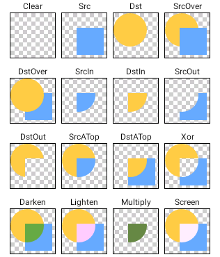

# UI这些小事

> 整理：邢乐
> 摘要：本文主要是UI修改一些小技巧，以及容易出现问题的情况。除此之外有其他的问题可以私下讨论。

## 一、常用View属性说明

### Gravity

- `android:layout_gravity`：用来控制元素在该控件里的显示位置
- `android:gravity`：用来控制该控件在包含该控件的父控件中的位置

采用LinearLayout布局时，有以下特殊情况需要注意：

1. 当`android:orientation="vertical"`时，`android:layout_gravity`有水平方向的设置才起作用，垂直方向的设置不起作用。即：left，right，center_horizontal 是生效的。
2. 当`android:orientation="horizontal"`时，`android:layout_gravity`只有垂直方向的设置才起作用，水平方向的设置不起作用。即：top，bottom，center_vertical 是生效的。

一般在FrameLayout/LinearLayout中的布局使用Gravity，在RelativeLayout中不要使用Gravity，而应该使用对应的`layout_*`属性，如：

- `layout_above/layout_below`
- `layout_align*`
- `layout_center*`
- `layout_to*Of`

### Weight

> 限LinearLayout及其子控件使用

`android:weightSum`：父控件使用，控制整体布局宽度（常用与子控件不占满父布局）
`android:layout_weight`：子控件使用，设置自己使用的父布局宽/高的比例

`android:layout_weight`是控件使用剩余空间的百分比，所以`layout_width/layout_height`使用`match_parent`和`wrap_content`是有区别的，建议用`0dp`。

### clipPadding clipChildren

`android:clipChildren`：clipChildren表示是否限制子View在其范围内，常见的场景是APP主界面底部工具/导航栏。 默认为true，也就是不允许进行扩展绘制。那么视图的显示就会受到父控件尺寸的限制。设置为false后，当子控件的宽/高度大于父控件时也会完全显示，而不会被压缩。

`android:clipToPadding`：clipToPadding用来定义ViewGroup是否允许在padding中绘制。默认为ture， 也就是把padding中的内容进行裁切，如图片超出边界后被裁剪。

## 二、Drawable

参考：
- http://keeganlee.me/post/android/20150916
- https://developer.android.google.cn/guide/topics/resources/drawable-resource.html
- https://developer.android.google.cn/guide/topics/resources/animation-resource.html

Android上的Drawable是指可以绘制到屏幕上的一类资源。目前包括以下类型：

- **BitmapDrawable**：png、jpg等图片文件生成
- **NinePatchDrawable**：9.png格式文件生成
- **ColorDrawable**：颜色图（纯色）
- **ShapeDrawable**：基本形状图
- **VectorDrawable**：矢量图
- **LayerDrawable**：多个Drawable组成的有序层叠图

- **GradientDrawable**：颜色渐变
- **PictureDrawable**：包装一个Picture，Picture记录一组Canvas绘制操作（性能比逐个draw方法好）
- **RippleDrawable**：波纹效果

- **ClipDrawable**：对drawable进行裁剪（setLevel）
- **InsetDrawable**：对drawable设置边距
- **RotateDrawable**：对drawable进行旋转（setLevel）
- **ScaleDrawable**：对drawable进行缩放（setLevel）

- **AnimationDrawable**：帧动画(图)
- **TransitionDrawable**：过度(图)，继承自layer-list的，管理两层drawable，支持两层之间切换动画
- **LevelListDrawable**：等级(图)，一组drawable，每个drawable设置一组level范围（setLevel）
- **StateListDrawable**：状态(图)，不同状态显示不同Drawable
- **AnimatedRotateDrawable**：旋转动画(图)

- **AdaptiveIconDrawable**：自适应图标（两层：内容和背景），根据系统设置显示不同的效果（方/圆等）
- **AnimatedVectorDrawable**：矢量图动画(图)
- **AnimatedStateListDrawable**：为不同状态切换提供transition动画(图)

### item

在xml中定义drawable时，包含多个Drawable的类型（每个item包含一个子drawable），对item的要求如下：

1. 根节点不同时，可设置的属性是会不同的，比如selector下，可以设置一些状态属性，而在layer-list下，可以设置偏移量；
2. 就算父节点同样是selector，放在drawable目录和放在color目录下可用的属性也会不同，比如drawable目录下可用的属性为`android:drawable`，在color目录下可用的属性为`android:color`；
3. item的子节点可以为任何类型的drawable类标签。

### ImageView.ScaleType

1. CENTER：图片位于视图中间，但不执行缩放。
2. CENTER_CROP：等比例缩放图片，图片的宽度和高度等于或者大于视图的相应维度
3. CENTER_INSIDE：等比例缩放图片，图片的宽度和高度等于或者小于视图的相应维度
4. FIT_CENTER：等比例缩放图片，结果居中显示
5. FIT_END：等比例缩放图片，结果与View右下对齐
6. FIT_START：等比例缩放图片，结果与View左上对齐
7. FIT_XY：（非等比例）缩放图片，适应View宽高，填满View
8. IMATRIX：使用图片矩阵缩放

## 三、动画

上一部分的动画属于Drawable动画，Android还支持视图动画(View Animation)和属性动画(Property Animation)。视图动画比较简单，只能应用于各种View，可以做一些位置、大小、旋转和透明度的简单转变。属性动画则提供了更多特性和灵活性，也可以应用于任何对象，而不只是View。

- 视图动画
> 可以通过xml文件定义，xml文件放于res/anim/目录下，根元素可以为：`<alpha>`, `<scale>`, `<translate>`, `<rotate>`, 或者`<set>`。其中，`<set>`标签定义的是动画集，它可以包含多个其他标签，也可以嵌套`<set>`标签。默认情况下，所有动画会同时播放；如果想按顺序播放，则需要指定`startOffset*`属性；另外，还可以通过设置`interpolator`改变动画变化的速率，比如匀速、加速。

- 属性动画
> 属性动画也可以通过xml文件定义，不同的是属性动画的xml文件则放于res/animator/目录下。属性动画主要有三个元素：`<animator>`、`<objectAnimator>`、`<set>`。 相对应的有三个类：`ValueAnimator`、`ObjectAnimator`、`AnimatorSet`。

    1. ValueAnimator是基本的动画类，通过监听某一value的变化，进行相应的操作。
    2. ObjectAnimator是ValueAnimator的子类，处理对象动画。
    3. AnimatorSet则为动画集，可以组合另外两种动画或动画集。

视图动画只能作用于View，而且视图动画改变的只是View的绘制效果，View真正的属性并没有改变。比如，一个按钮做平移的动画，虽然按钮的确做了平移，但按钮可点击的区域并没随着平移而改变，还是在原来的位置。而属性动画则可以改变真正的属性，从而实现按钮平移时点击区域也跟着平移。

## 四、Paint

在Android中如果是自定义控件的话，Paint用的比较多。直译就是画笔，保存了如何绘制图形、文字等的风格和颜色等信息。

### Paint style/setStyle(Style style)

- Paint.Style.FILL：填充内部
- Paint.Style.FILL_AND_STROKE  ：填充内部和描边
- Paint.Style.STROKE  ：描边

### Paint Cap 线条末端/setStrokeCap(Cap cap)

- Paint.Cap.BUTT：无投影
- Paint.Cap.ROUND：圆角投影
- Paint.Cap.SQUARE：方形投影

### Paint Join 线条连接/setStrokeJoin(Join join)

- Paint.Join.MITER：尖角
- Paint.Join.ROUND：圆角
- Paint.Join.BEVEL：直线

### Paint Align 文字对齐/setTextAlign(Align align)

- Paint.Align.LEFT：指定坐标的右侧
- Paint.Align.CENTER：指定坐标水平居中
- Paint.Align.RIGHT：指定坐标的左侧

### Shader 着色器/setShader(Shader shader)

着色器就是用来上色的，可以用来实现一系列的渐变、渲染效果，有5个子类

- BitmapShader 位图Shader
- LinearGradient 线性Shader
- RadialGradient 光束Shader
- SweepGradient 梯度Shader
- ComposeShader 混合Shader，两个Shader混合效果

BitmapShader是唯一个可以用来给一个图片着色，其他四个就是渐变、渲染效果。

TileMode是Shader中的一个枚举，有三个值：
- CLAMP 拉伸，图片的最后的一个像素，不断重复
- REPEAT 重复，横向、纵向不断重复
- MIRROR 镜像，横向不断翻转重复，纵向不断翻转重复

### ColorFilter/setColorFilter(ColorFilter filter)

设置画笔颜色过滤器，有ColorMatrixColorFilter，LightingColorFilter，PorterDuffColorFilter几种。

Drawable、ImageView都有该方法，功能类似。

### setXfermode(Xfermode xfermode)

设置图形重叠时的显示方式，PorterDuffXfermode是最常用的实现类（效果如图）。

Drawable、ImageView都有该方法，功能类似。

## 五、自定义View

重点：可以用现有的属性、style、theme实现的，就不要自定义了。

自定义View基本流程：
1. 自己扩展View或其子类
2. 在自己的xml或Java中使用该类

选择扩展哪个类：
- 以最少重写代码为原则，需要的功能与哪个已有View最接近
- 以最大自由度为原则，扩展View/ViewGroup

需要复写的方法：
- 构造方法（初始化数据、参数，需要自定义attr时必须）
- onFinishInflate() （xml加载解析完成时调用，设置View初始显示状态）
- onDraw() （动态刷新View内容）
- onMeasure()/onLayout() （深度定制）
- 其他View子类的特定方法