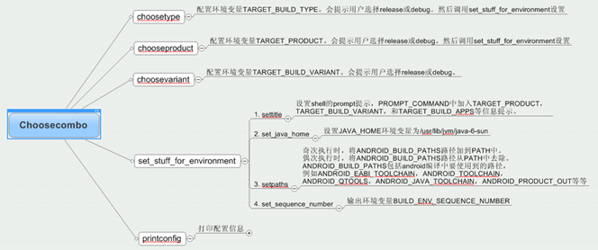
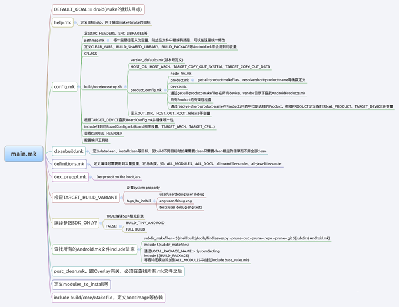
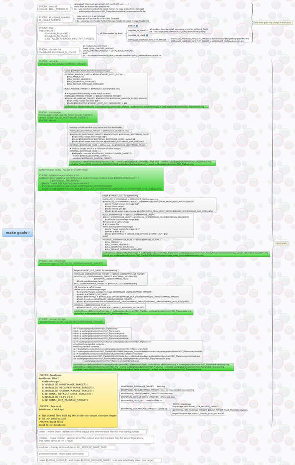

```shell
. build/envsetup.sh     #执行后可以使用以下命令，命令的后面加-help来查看帮助。
      - croot: Changes directory to the top of the tree.
      - m: Makes from the top of the tree.
      - mm: Builds all of the modules in the current directory.
      - mmm: Builds all of the modules in the supplied directories.
      - cgrep: Greps on all local C/C++ files.
      - jgrep: Greps on all local Java files.
      - resgrep: Greps on all local res/*.xml files.
      - godir: Go to the directory containing a file.

make snod        #打包system.img文件
```

####一、 Android编译系统的架构

Android编译系统完成的不仅仅是对目标系统二进制文件、java应用程序的编译、链接、打包等，而且还有包括生成各种依赖关系、确保某个模块的修改引起相依赖的文件的重新编译链接，甚至还包括目标文件系统的生成，配置文件的生成等，因此Android编译系统具有支持多架构、多语言、多目标、多编译方式。这些目标和结构决定其架构也很重要。

Android编译系统集中于build/core下，几个重要的*.mk如下：

- main.mk：Makefile，是老大，承担了很多工作。
- base_rules.mk：对一些Makefile的变量规则化。
- config.mk：配置编译参数、编译命令。
- definations.mk：定义了很多编译系统中用到的宏，相当于函数库。
- Makefile：指build/core下的Makefile，此文件主要控制生成system.img，ramdisk.img，userdate.img，recorvery image等。
- Binary.mk：控制如何生成目标文件。
- Clear_vars.mk：清除编译系统中用到临时变量。
- copy_headers.mk：将头文件拷贝到指定目录。
- Annroid.mk：分散于各个目录下的Android.mk文件，控制生成局部模块的源码，名称所需头文件路径，依赖库等特殊选项。
- build/envsetup.sh：编译环境初始化，定义了一些有用的shell函数，方便编译使用。

####二、 编译步骤原理

从编译步骤入手分析。
```
1) source build/envsetup.sh;
2) choosecombo release msm8610 user;
3) make;
```

#####source build/envsetup.sh

这个命令是用来将envsetup.sh里的所有用到的命令加载到环境变量中去，加载了编译时使用到的函数，如lunch，mm，mmm，choosecombo等。打开这个文件可以看到定义了很多函数。常用的如下：
```shell
function choosecombo()　　　# 设置编译参数
function mm()　　　　　　  # make from current directory
```
如果当前路径是代码树顶层，则mm相当于make。如果是深层，测mm相当于`ONE_SHOT_MAKEFILE=$M make -C $T files $@`

>$M是findmkefile发现的Android.mk，$T是代码树顶层路径，files是main.mk中定义的phony goal，就是完成$M对应目录范围内，所有android需编译的modules以及辅助说明txt文件。

```shell
function mmm()　　　　　　# make the supplied directories
```

从vendor目录下查找vendorsetup.sh文件，如果查到了，就加载它，添加厂商自己定义产品的编译选项。
```shell
# Execute the contents of any vendorsetup.sh files we can find.
for f in `test -d device && find -L device -maxdepth 4 -name 'vendorsetup.sh' 2> /dev/null | sort` \
         `test -d vendor && find -L vendor -maxdepth 4 -name 'vendorsetup.sh' 2> /dev/null | sort`
do
    echo "including $f"
    . $f
done
unset f
```

#####choosecombo

设置编译参数，看这张思维导图，可以看到choosecombo依次调用如下函数，经常参数配置。



配置完编译参数以后，可以看到打印出的配置信息。

####三、 Makefile的主要流程

主要流程都在build/core/main.mk里安排。
- 初始化相关的参数设置（buildspec.mk、envsetup.mk、config.mk）
- 检测编译环境和目标环境
- 决定目标product
- 读取product的配置信息及目标平台信息
- 清楚输出目录
- 检测版本号
- 读取Board的配置
- 读取所有的Module的配置
- 根据配置产生必要的规则（build/core/Makefile）
- 生成image



所有的Makefile都通过build/core/main.mk这个文件组织在一起，它定义了一个默认goals：droid，当我们在TOP目录下，敲Make实际上就等同于我们执行make droid。

当Make include所有的文件，完成对所有make我文件的解析以后就会寻找生成droid的规则，依次生成它的依赖，直到所有满足的模块被编译好，然后使用相应的工具打包成相应的img。其中，config.mk，envsetup.mk，product_config.mk文件是编译用户指定平台系统的关键文件。

1. 设定第一个目标：DEFAULT_GOAL:=droid，在用户输入make之后，如果不加任何参数，那么默认的目标就是droid，虽然后面的include $(BUILD_SYSTEM)/config.mk写在默认目标droid依赖之后，但该目标之后的语句都是要执行的，着有makefile的语法决定的。
2. 包含config.mk：include $(BUILD_SYSTEM)/config.mk，config.mk是一个总括性的文件，它里面定义了各种module编译需要使用的HOST工具以及如何来编译各种模块。
3. 包含cleanbuild.mk，cleanbuild.mk完成三件事，一是载入所有的CleanSpec.mk，二是检查更新clean_steps.mk和previous_build_config.mk，避免不用编译间的互相干扰，最后是定义installclean和dataclean。
4. 包含definition.mk：defination.mk中定义了很多编译系统中用到的宏，这些宏在编译时需要经常调用，因此在编译的很靠前的阶段，就将之包含了进来。
5. TARGET_BUILD_VARIANT在buildspec.mk设定，这个参数决定了要安装的模块。
6. 将subdirs目录下所有的Android.mk文件include到编译系统中，进行编译。
build/tartget/board/Android.mk文件也被包含进来，它从TARGET_DEVICE_DIR目录下查找并包含AndroidBoard.mk文件，如果找不到就报错。
7. include build/core/Makefile：Makefile定义了目标的依赖关系，system.img，ramdisk.img，userdate.img，recorvery.img等。

####四、 生成各种img的方式

在build/core/Makefile这个文件中，定制了生成各种img的方式，包括ramdisk.img，userdate.img，system.img，recover.img等。我们可以看看这些img都是如何生成的。

从如下这张思维图中，可以详细的看到各个img生成的详细过程。

