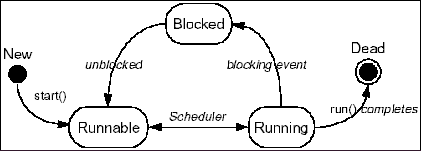
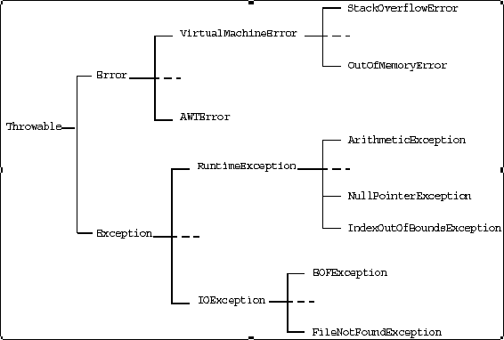

#### 常用类

- String类：重点关注字符串与其它数据类型转换方法，valueOf
- StringBuffer类
- StringTokenizer类：
- Map、ArrayList、Treeset、HashMap
- Vector向量类与数组的转换
- 日期和时间类：Date

#### 编程规范

- 性能关键的地方字符串的拼接不能使用+，应该使用StringBuffer
- 使用System.arrayCopy()，数组拷贝
- 避免在循环体中的临时对象创建，大量的临时对象创建将严重影响性能
- 在循环体中避免声明变量，提高代码运行性能
- 禁止将null作为equals方法的参数
- 禁止直接catch 异常“'RuntimeException'”或者” 'Throwable”，而应该捕获具体的异常类型。对于catch “Exception”的情况，只允许在实现线程的run方法或者finally语句块中出现，特殊情况的，需要注释说明。
- 定义扩展Exception类的异常，避免直接抛出Exception类异常，防止可能的捕获不到某些异常。
- 所有使用了equals方法的类，必须重载equals方法
- 所有在HashTable、HashMap中保存的类，必须重载equals和hashCode方法。
- 进行字符串分割操作时，使用 'StringTokenizer' 替代 'indexOf()' 或 'subString ()'。
- 避免给方法里的参数赋值。
- 返回值以零长度数组替代null。
- 如有打开的数据流，在finally语句块中关闭数据流，避免潜在的bugs。

#### 线程调度



#### 异常



#### 经验

- Java中不能将非布尔型看成整型；==与equals()
- boolean/1bit，char/16bits，byte/8bits，short/16bits，int/32bits，long/64bits，float/32bits，double/64bits，void；类型长度与平台无关，都是固定的，所以没有sizeof；
- 无符号右移操作符>>>
- 小于int的主数据整型算术运算前提升为int，结束后要cast回去；右移算法有限制，int只移动右侧5位，long只移6位；
- 不能对Boolean类型进行cast造型
- 用+连接字串必须第一个是String
- continue break 有带标签用法
- 可以在ctor中用this调用另一个ctor，但只能一个，而且必须是ctor中第一个操作；不能在其它类方法中调用ctor
- 垃圾收集器不是dtor，finalize()用来做一些有C风格的事，如free()
- 类属性会被自动赋值为0/NULL；类先初始化static成员，再非static成员，再ctor
- static构建从句:
```Java
class Name {
static int i;
static{ i = 45; }
...
}//只执行一次
```
- 每个类成员都要写权限，不写为友好；对包外类来说，所有都是私有的，同一包的类都是友好的；private谁都不能访问，友好-同一包内可以访问，protected继承类可以访问；
- 每一个编译单元中有且只能有一个public类，拥有与.java文件相同的名字；也可以没有public类，文件名可以自己定义；类只能是public或者友好；
- 相同文件夹内没有明确包名的文件被看作该目录“默认包”的一部分，对目录内其它文件是友好的；
- 将ctor私有，可防止继承；也防止直接创建一个类对象；如果要使用这个类，可以创建一个static方法，返回一个该类的一个对象句柄；或者使用singleton，它仅允许创建一个对象，类对象被创建成一个static private成员，只能通过public方法access()访问；
- 可以为每个类定义main()方法用于单元测试
- 派生类不会覆盖父类同名函数，可以用super.func()来调用父类函数；
>- 重载父类已重载的函数也不会出现错误，名字匹配时，处于同一级；
>- 在派生类ctor中调用父类含参ctor时，用super(i)；

- final表示不可改变；final初始化后必须在ctor中赋值；
>- final方法不能被派生类修改；final方法会默认内联；private方法自动内联；
>- final类不能被派生；所以一个final类中所有方法都默认为final；

- 有abstract方法的类必须定义为抽象类，抽象类的派生类必须重新实现所有抽象方；没有抽象方法的类也可以声明为抽象类，不能定义对应类的对象；
- class/extends，interface/implements，接口中的数据成员默认static和final；接口中的方法默认为public，省略也是public；实现一个接口时，其中的方法必须声明为public；
- 继承不会改变基础类成员的保护级别，派生类的方法不能减少对基础类方法的访问；
- 类只能从一个非接口类继承，但可以实现多个接口；可以通过继承扩展接口，此时可以extends多个接口，用逗号隔开；
- 接口中的字段自动static和final，不能是空白final，但可以初始化为非常数表达式或常数；可以实现类似enum的功能；
- 在除外部类非static方法内部之外,任何地方生成内部类的一个对象，要用"外部类名.内部类名"来引用；内部类可以private/protected，protected也是包友好的；
>- 内部类可以在函数块内，条件语句块内定义，甚至return语句中；
>- 匿名内部类不能有ctor，所以必须在定义时初始化；
>- 定义匿名内部类，若想使用该类外部定义的一个对象，处部对象要为final；
>- 内部类有对封装类所有成员的访问权限；内部类对象持有创建它的封装类的一个对象的句柄；

- 内部类不能有static成员或static内部类；不能从static内部类访问外部类对象，所以所有封装类的内部类和方法都要static；
>- 生成外部类对象句柄：外部类名.this；
>- 创建其它类的内部类对象：封装类对象.new 内部类名()；
>- 内部类在封装类子类中不能被覆盖；
>- 内部类会生成一个.class文件，名字为外部类名$内部类名；

- 初始化顺序：基础类ctor-声明顺序初始化成员-衍生类ctor主体；
- 初始化的时候必须覆盖衍生类的finalize()方法，其中必须调用父类finalize()；必须执行System.runFinalizersOnExit(true)以保证所有finalizers被调用；
- 数组可以作为返回类型，可以直接用数组名为另一个数组赋值，但此时两个数组指向同一块内存；数组有一个只读成员length；
- 集合中只能存储对象句柄，所以不能存内置类型；为在散列表中使用自己的类作为键使用，必须同时覆盖hashCode()和equals()；
- 函数中可能抛出异常：`void fun() throws Ex1, Ex2 {};`
>- catch(Exception e)可以捕获所有异常；
>- Throwable是Exception和Error的父类；
>- finally从句用来执行必须的操作，无论何时都会执行；//存在缺陷

- 覆盖方法时，只能产生已经在方法基础类版本中已定义的异常；
- OutputStream InputStream RandomAccessFile, StreamTokenizer; System.out System.err可以直接使用，System.in必须先封装；
- 序列化接口：Serializable，Externalizable
- Class对象，每一个类都有一个Class对象，用于RTTI；Class.forName("Name");
>- 类标记-用于产生Class对象的句柄：Name.class;
>- 基本类型boolean.class等价于Boolean.TYPE;
>- x instanceof ClassName---用于判断对象x是不是ClassName类的实例；
>- ClassHandle.isInstance(x)动态判断；

- Class对象的方法：getClass(), getSuperclass()......
- 制作对象本地副本，可以在当前类中public覆盖Object中的clone()方法；
>- 调用clone()方法复制的对象要强制转换为当前类型，因为clone产生对象为Object；
>- clone在Object中是protected的，不能在子类对象上自动运行，必须重写；
>- 重写时，一定要调用super.clone()，而且设为public；
>- 实现clone对象，也必须实现Cloneable接口，否则会出现异常；

- 将类设为final，可以防止克隆；
>- 只读类：所有数据private，没有改变对象数据的public方法；
>- String类是不可变的，可以用StringBuffer类来作mutable String类；

- AWT：applet, Frame, Dialog; Canvas, Panel, XXLayout; event, XXListener;
- 重载update()，在其中调用paint()可以消除闪烁；
- 接口Introspector的方法getBeanInfo()可以对类进行查询；
- Beans Swing库
- Thread类可以派生线程类，其中要重载线程函数run()，启动一个线程调用start()，它会对线程进行初始化，并调用run();
- 主程序类实现Runnable接口，实现run()方法，创建一个线程并为其传递Runnable对象，然后为线程显式调用start()； P500-试验
- Daemon线程是后台运行的服务；一旦非Daemon线程全部完成，它也会中止运行；
>- isDaemon()可以查询线程是否Daemon，setDaemon()用于改变线程的Daemon状态；
>- Daemon线程创建的其它线程也自动具有Daemon属性；
>- run()中调用yield()，放弃对CPU的控制权；

- 声明方法为synchronized，可保证同时只有一个线程调用对象的synchronized方法；
>- 一个对象的所有synchronized方法共享同一把锁，防止多方法对内存进行写操作；
>- 每个类也有自己的一把锁，synchronized static方法即可实现；

- 代码同步-临界区：synchronized(synchObj){//block},run()中synchObj为this；
- 堵塞原因：sleep(),suspend()/resume(),wait()/notify(),IO操作，同步锁定；
>- wait()方法执行期间，可以调用线程对象的其它方法；
>- 只能为自己的锁定调用wait和notify方法；
>- sleep，suspend，resume可以在不同步的方法中调用，它们不需要对锁定进行操作；
>- 中止线程用interrupt(),不要用stop()和destroy()；

- 线程组，优先级: 子组最大优先级<=父组的最大优先级；默认线程属于系统线程组；
- InetAddress的静态方法getByName()可以通过计算机名获得IP地址；传null返回localhost；getLocalHost(), getAllByName();
- ServerSocket/Socket，getInputStream()/getOutputStream()从套接字产生对应的IO流对象，这些流必须封装到缓冲区；ServerSocket只要一个端口号，不需要IP地址；
- 服务器等候建立一个连接，用accept()返回的Socket对象建立一个IO流；客户机与服务器连接后，创建一个IO流；
>一定要保证Socket在关闭后得到清除，不然资源被占用，可以用finally close();

- DatagramSocket用于收发数据报，而DatagramPacket包含了具体的信息；
>准备接收数据报时，只需提供一个缓冲区，建立一个packet即可，可以重复使用接收代码；发出数据报时，要提供缓冲区，IP地址和端口号；

- Runtime.getRuntime().exec()方法可以运行独立程序，返回一个Process对象；
>可以通过该Process对象获得IO流与独立程序的标准输入输出对接；

- cgi通用网关接口，URL(+，=，&，%，?)；
>- RMI远程方法调用：远程接口必须public，必须扩展接口java.rmi.Remote；作为参数或返回值传递的一个远程对象，必须声明为远程接口，不能为实施类；
>- 服务器必须包含一个扩展了UnicastRemoteObject的类，并实现远程接口；
>- 客户只能使用远程接口中的方法；必须为远程对象定义构建器，ctor还必须掷出RemoteException；
