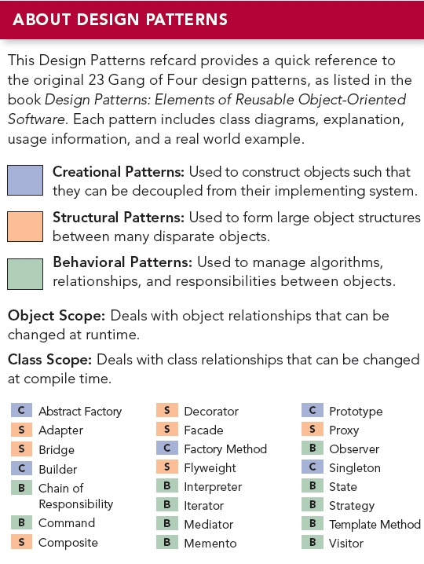

####创建模式(Creational Pattern)

创建模式是对类的实例化过程的抽象化。分为类的创建模式和对象的创建模式。一些系统在创建对象时，需要动态的决定怎样创建对象，创建那些对象，以及如何组合和表示这些对象。创建模式描述了如何构造和封装这些动态的决定。
1. 类的创建模式  使用继承关系，把类的创建延迟到子类，从而封装了客户端将得到哪些具体类的信息，并且隐藏了这些类的实例是如何被创建和放在一起的。
2. 把对象的创建过程动态的委派给另一个对象，从而动态地决定客户端将得到那些具体类的实例，以及这些类的实例是如何被创建和组合在一起的。

包括：简单工厂（Simple Factory），工厂方法（Factory Method），抽象工厂（Abstract Factory），单例（Singleton），多例（Multiton），建造（Builder），原始模型（Prototype）等。

####结构模式（Structural Pattern）

结构模式描述如何将类或者对象结合在一起形成更大的结构。结构模式描述类和实例这两种不同的东西。
1. 类的结构模式  使用继承来把类、接口等组合在一起，以形成更大的结构。当一个类从父类继承并实现某接口时，这个新的类就把父类的结构和接口的结构结合起来。类的结构模式是静态的。
2. 对象的结构模式  描述怎样把各种不同类型的对象组合在一起，以实现新的功能的方法。对象的结构模式是动态的。

包括：适配器（Adapter），缺省适配（Default Adapter），合成(Composite)，装饰(Decorator)，代理(Proxy)，享元（Flyweight），门面（Facade），桥接（Bridge）等。

####行为模式（Behavioral Pattern）

行为模式是对在不同对象之间划分责任和算法的抽象化。行为模式不仅仅是关于类和对象的，而且是关于它们之间的相互作用的。分为
1. 类的行为模式  使用继承关系在几个类之间分配行为。
2. 对象的行为模式  使用对象的聚合来分配行为。

包括：不变（Immutable），策略（Strategy），模板方法（Template Method），观察者（Observer），迭代子（Iterator），责任链（Chain of Responsibility），命令（Command），备忘录（Memento），状态（State），访问者（Visitor），解释器（Interpreter），调停者（Mediator）等。

####定义

`Abstract Factory`: 提供一个创建一系列相关或相互依赖对象的接口，而无需指定它们具体的类。

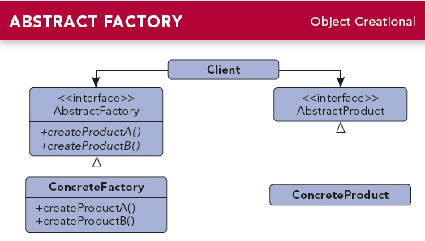

`Adapter`: 将一个类的接口转换成客户希望的另外一个接口。Adapter模式使得原本由于接口不兼容而不能一起工作的那些类可以一起工作。

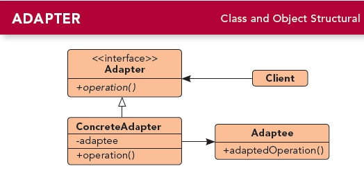

`Bridge`: 将抽象部分与它的实现部分分离，使它们都可以独立地变化。

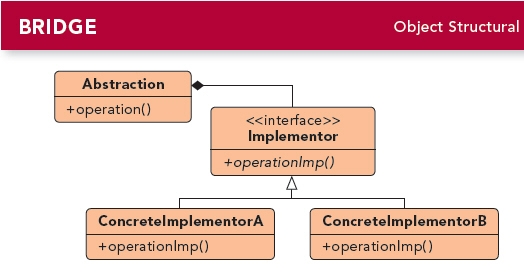

`Builder`: 将一个复杂对象的构建与它的表示分离，使得同样的构建过程可以创建不同的表示。

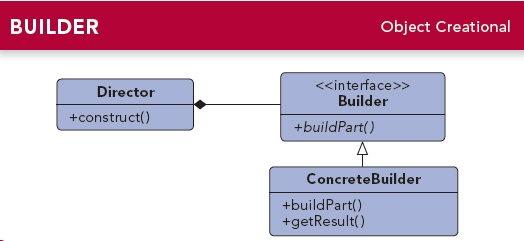

`Chain of Responsibility`: 为解除请求的发送者和接收者之间耦合，而使多个对象都有机会处理这个请求。将这些对象连成一条链，并沿着这条链传递该请求，直到有一个对象处理它。

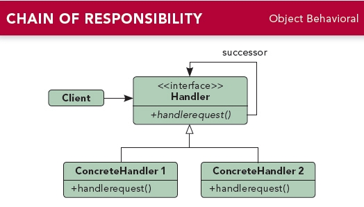

`Command`: 将一个请求封装为一个对象，从而使你可用不同的请求对客户进行参数化；对请求排队或记录请求日志，以及支持可取消的操作。

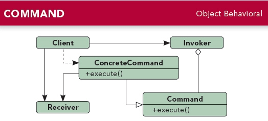

`Composite`: 将对象组合成树形结构以表示“部分-整体”的层次结构。Composite使得客户对单个对象和复合对象的使用具有一致性。

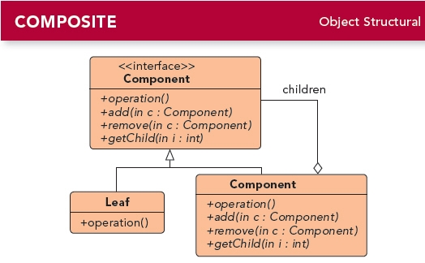

`Decorator`: 动态地给一个对象添加一些额外的职责。就扩展功能而言，Decorator模式比生成子类方式更为灵活。

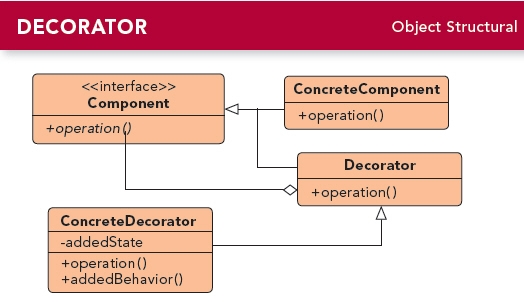

`Facade`: 为子系统中的一组接口提供一个一致的界面，Facade模式定义了一个高层接口，这个接口使得这一子系统更加容易使用。

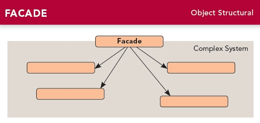

`Factory Method`: 定义一个用于创建对象的接口，让子类决定将哪一个类实例化。Factory Method使一个类的实例化延迟到其子类。

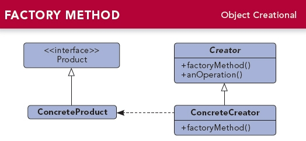

`Flyweight`: 运用共享技术有效地支持大量细粒度的对象。

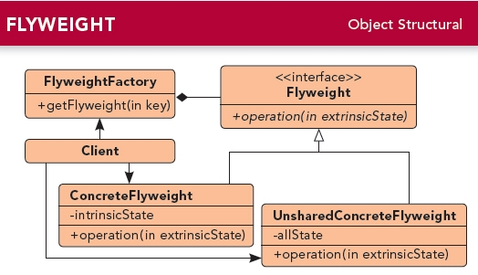

`Interpreter`: 给定一个语言，定义它的文法的一种表示，并定义一个解释器，该解释器使用该表示来解释语言中的句子。

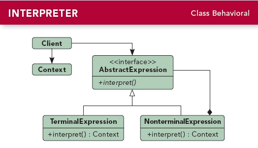

`Iterator`: 提供一种方法顺序访问一个聚合对象中各个元素，而又不需要暴露该对象的内部表示。

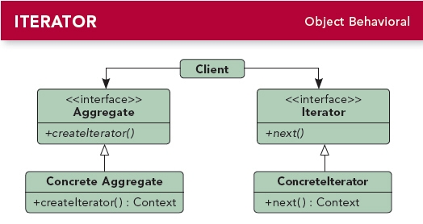

`Mediator`: 用一个中介对象来封装一系列的对象交互。中介者使各对象不需要显式地相互引用，从而使其耦合度松散，而且可以独立地改变它们之间的交互。

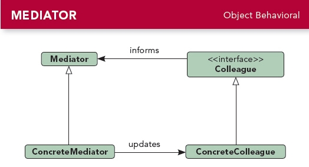

`Memento`: 在不破坏封装性的前提下，捕获一个对象的内部状态，并在该对象之外保存这个状态。这样以后就可将该对象恢复到保存的状态。

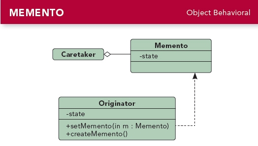

`Observer`: 定义对象间的一种一对多的依赖关系，以便当一个对象的状态发生改变时，所有依赖于它的对象都得到通知并自动刷新。

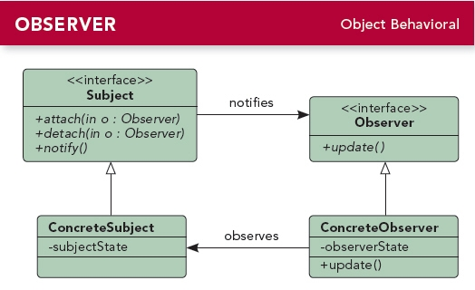

`Prototype`: 用原型实例指定创建对象的种类，并且通过拷贝这个原型来创建新的对象。

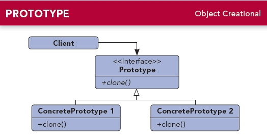

`Proxy`: 为其他对象提供一个代理以控制对这个对象的访问。

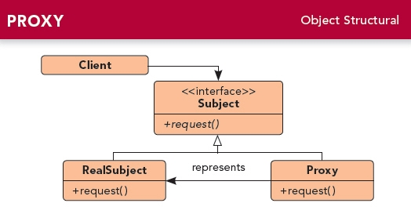

`Singleton`: 保证一个类仅有一个实例，并提供一个访问它的全局访问点。

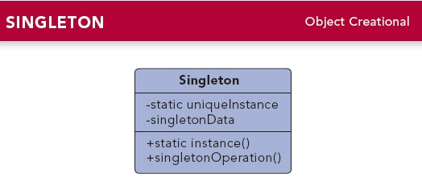

`State`: 允许一个对象在其内部状态改变时改变它的行为。对象看起来似乎修改了它所属的类。

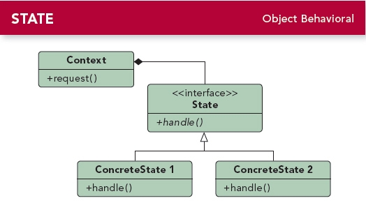

`Strategy`: 定义一系列的算法，把它们一个个封装起来，并且使它们可相互替换。本模式使得算法的变化可独立于使用它的客户。

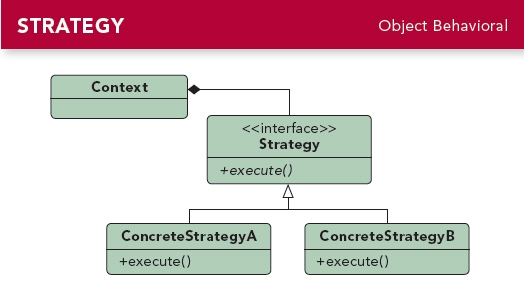

`Template Method`: 定义一个操作中的算法的骨架，而将一些步骤延迟到子类中。Template Method使得子类可以不改变一个算法的结构即可重定义该算法的某些特定步骤。

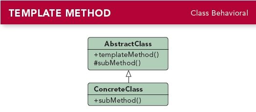

`Visitor`: 表示一个作用于某对象结构中的各元素的操作。它使得你可以不改变各元素的类的前提下定义作用于这些元素的新操作。

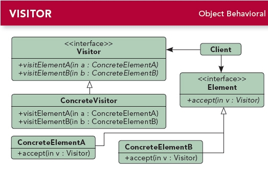
